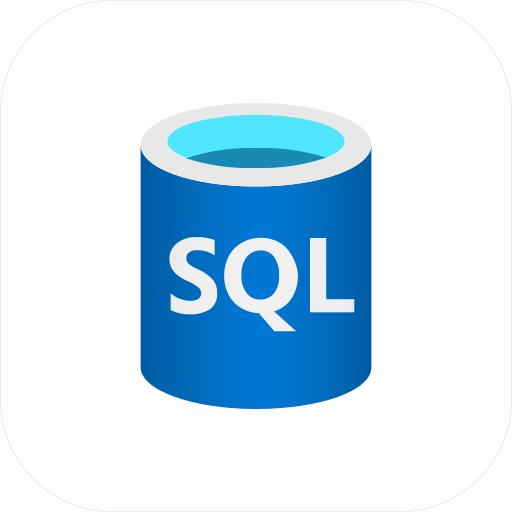

<p align="center">
  
</p>

# Microsoft SQL agent skills

Agent plugins from the Microsoft SQL product team for building, operating, and migrating
Microsoft SQL data platforms. The skills correct common agent mistakes with product-specific,
measured guidance for Azure SQL Database, the Azure SQL Database container, SQL Server to Azure
migration, and Fabric Database Hub estate observability.

[](https://learn.microsoft.com/sql/)
[](https://agent-plugins.org/specification)
[](https://agentskills.io/)
[](#choose-a-plugin)
[](#choose-a-plugin)
[](../../discussions)

Agent skills are folders of instructions and references that an agent discovers and loads when
the task calls for them. Install a plugin once, then ask for what you need in your own words.
There is no special prompt syntax to remember.

This repository is the installable `microsoft-sql` marketplace. It contains five portable
[Agent Plugins 1.0](https://agent-plugins.org/specification) packages with compatibility
descriptors for GitHub Copilot, Claude Code, Codex, Cursor, and Grok Build.

## Choose a plugin

The marketplace name is `microsoft-sql`. Install coordinates use
`<plugin>@microsoft-sql`.

| Plugin | Install coordinate | Version | Skills | Use it for |
| --- | --- | ---: | ---: | --- |
| [`microsoft-sql`](plugins/microsoft-sql/) | `microsoft-sql@microsoft-sql` | 1.0.0 | 57 | The complete Azure SQL Database collection for users driving an agent directly |
| [`microsoft-sql-vscode`](plugins/microsoft-sql-vscode/) | `microsoft-sql-vscode@microsoft-sql` | 0.1.0 | 23 | Application development in Visual Studio Code with the MSSQL extension |
| [`microsoft-sql-ssms`](plugins/microsoft-sql-ssms/) | `microsoft-sql-ssms@microsoft-sql` | 0.1.0 | 15 | Database administration in SQL Server Management Studio |
| [`microsoft-sql-migration`](plugins/microsoft-sql-migration/) | `microsoft-sql-migration@microsoft-sql` | 1.1.0 | 12 | Assessing, planning, executing, and validating SQL Server to Azure migrations |
| [`microsoft-sql-fdh`](plugins/microsoft-sql-fdh/) | `microsoft-sql-fdh@microsoft-sql` | 0.1.0 | 1 | Read-only Fabric Database Hub inventory, health, and security posture |

`microsoft-sql-vscode` and `microsoft-sql-ssms` are curated subsets of `microsoft-sql`.
Normally install **one** of those three:

- Choose `microsoft-sql` for a general-purpose terminal or coding agent.
- Choose `microsoft-sql-vscode` for the MSSQL extension. It omits Data API Builder skills that
  overlap with agent tools supplied by the extension.
- Choose `microsoft-sql-ssms` for database administration. It omits application frameworks,
  serverless bindings, Data API Builder, RAG, and app-scaffolding skills.

`microsoft-sql-migration` and `microsoft-sql-fdh` are separate workflow plugins and can be
installed alongside any of the three Azure SQL bundles.

### `microsoft-sql`: complete collection

The complete 57-skill bundle covers:

- provisioning, service tiers, local containers, and local-to-cloud parity;
- .NET, Python, and TypeScript drivers, pooling, retry, and Microsoft Entra authentication;
- schema design, Entity Framework Core, Prisma, SQLAlchemy, database projects, and safe
  migrations;
- T-SQL correctness, JSON, safe upserts, SQL injection prevention, and row-level security;
- Azure Functions, Data API Builder, application deployment, GitHub Actions, and CI;
- vectors, embeddings, LangChain, LlamaIndex, and retrieval-augmented generation;
- Query Store, execution plans, blocking, deadlocks, Extended Events, and resource pressure;
- bulk loading, SqlPackage import/export, restore, and recovery; and
- the full Azure SQL Database container workflow.

[View all 57 skills and descriptions](plugins/microsoft-sql/README.md).

### `microsoft-sql-vscode`: MSSQL extension curation

The 23-skill VS Code bundle focuses on application development:

- connections and drivers for .NET, Python, TypeScript, and Node.js;
- EF Core, Prisma, SQLAlchemy, schema design, and database projects;
- T-SQL correctness, JSON, upserts, and injection prevention;
- Microsoft Entra authentication;
- vectors, embeddings, RAG, LangChain, and LlamaIndex;
- Azure Functions SQL bindings;
- dev-container templates and safe schema migrations; and
- skill feedback.

It deliberately excludes `dab-rest-and-graphql`, `azuresql-db-dab`, and the broad
`build-app-on-azure-sql` router so the plugin does not compete with tools already supplied by
the MSSQL extension.

[View the exact 23-skill list](plugins/microsoft-sql-vscode/README.md).

### `microsoft-sql-ssms`: database administrator curation

The 15-skill SSMS bundle focuses on operating databases:

- slow-query, blocking, deadlock, connection, and resource-pressure diagnosis;
- execution plans and database-scoped Extended Events;
- restore, recovery, and row-level security;
- injection prevention and Microsoft Entra authentication;
- Azure SQL Database and Hyperscale provisioning;
- bulk loading and SqlPackage import/export; and
- skill feedback.

It leaves application frameworks, Azure Functions, Data API Builder, RAG, and app scaffolding
to development-focused hosts.

[View the exact 15-skill list](plugins/microsoft-sql-ssms/README.md).

### `microsoft-sql-migration`: SQL Server to Azure

The migration bundle contains 12 skills that:

- recommend a target, assessment path, and migration method;
- run, retrieve, and evaluate Azure Arc migration assessments;
- evaluate offline migration readiness;
- size Azure SQL targets from measured performance;
- analyze readiness across an estate;
- generate path-specific prerequisite plans;
- migrate with backup/restore to SQL Server on Azure VM;
- migrate with BACPAC to Azure SQL Database;
- migrate with Log Replay Service to Azure SQL Managed Instance; and
- validate source and target data after migration.

[View all 12 migration skills](plugins/microsoft-sql-migration/README.md).

### `microsoft-sql-fdh`: Fabric Database Hub

The Fabric Database Hub plugin contains the `databasehub-cli` skill. It uses read-only,
delegated-user Fabric API calls to analyze:

- tenant-wide Azure SQL, Arc SQL Server, PostgreSQL, Cosmos DB, and Fabric SQL inventory;
- SQL and PostgreSQL CPU, storage, and memory health;
- Cosmos DB availability and normalized RU coverage; and
- security findings, authentication, auditing, and customer-managed-key posture.

The plugin is draft quality: local evaluation passed with findings on 2026-09-22, while live
Fabric qualification remains pending.

[View the Database Hub skill](plugins/microsoft-sql-fdh/README.md).

## Installation

Review plugins before installing them. The examples below register this repository as the
`microsoft-sql` marketplace and install the complete bundle. Substitute another plugin ID from
the table above when you want a curated or workflow-specific bundle.

### GitHub Copilot CLI

```bash
copilot plugin marketplace add microsoft/microsoft-sql
copilot plugin marketplace browse microsoft-sql
copilot plugin install microsoft-sql@microsoft-sql
```

Inside an interactive session, use `/plugin` to manage plugins and `/skills` to inspect the
available skills.

### Claude Code

```text
/plugin marketplace add microsoft/microsoft-sql
/plugin install microsoft-sql@microsoft-sql
```

From a shell, the equivalent commands are:

```bash
claude plugin marketplace add microsoft/microsoft-sql
claude plugin install microsoft-sql@microsoft-sql
```

### OpenAI Codex CLI

```bash
codex plugin marketplace add microsoft/microsoft-sql --ref main
codex plugin list --marketplace microsoft-sql --available --json
codex plugin add microsoft-sql@microsoft-sql
```

### GitHub Copilot in Visual Studio Code

Enable Agent Plugins, add this repository to `chat.plugins.marketplaces`, then install a plugin
from the Extensions view by searching for `@agentPlugins`:

```json
{
  "chat.plugins.enabled": true,
  "chat.plugins.marketplaces": [
    "microsoft/microsoft-sql"
  ]
}
```

For the MSSQL extension, start with `microsoft-sql-vscode`.

### Cursor

For an individual local installation, clone the repository and copy one selected plugin into
Cursor's documented local plugin directory:

```bash
git clone https://github.com/microsoft/microsoft-sql.git
mkdir -p "$HOME/.cursor/plugins/local"
cp -R microsoft-sql/plugins/microsoft-sql-vscode \
  "$HOME/.cursor/plugins/local/microsoft-sql-vscode"
```

Restart Cursor or run **Developer: Reload Window**, then confirm the plugin under **Customize**.
On Teams and Enterprise, an administrator can instead use
**Dashboard > Plugins & MCPs > Add Marketplace > Import from Repo** with this repository URL.
Enterprise administrators must enable **Allow Local Plugin Imports** for the local path.

### Grok Build

Grok reads Claude-compatible plugins and supports a direct plugin directory for an isolated
session:

```bash
git clone https://github.com/microsoft/microsoft-sql.git
grok --plugin-dir microsoft-sql/plugins/microsoft-sql
```

Inside Grok, use `/plugins` and `/skills` to inspect what loaded. For a persistent installation,
copy the selected plugin to `~/.grok/plugins/<plugin-name>`.

### GitHub Copilot in SQL Server Management Studio

SSMS 22.7 or later discovers Agent Skills rather than installing the marketplace directly. Install
the **AI Assistance** workload, enable Agent mode, and copy the contents of
`plugins/microsoft-sql-ssms/skills/` to one documented skill root:

- workspace: `.github/skills/`, `.claude/skills/`, or `.agents/skills/`;
- personal: `~/.copilot/skills/`, `~/.claude/skills/`, or `~/.agents/skills/`.

Use only one location to avoid duplicates. Open **Tools > Skills** in Copilot Chat and confirm all
15 curated skills are visible.

### Local checkout for any supported client

```bash
git clone https://github.com/microsoft/microsoft-sql.git
cd microsoft-sql
```

Each plugin is self-contained under `plugins/<plugin>/`. Clients that discover
`SKILL.md` directly can copy the selected plugin's `skills/` directories into their standard
skill location.

## Examples

Skills route from ordinary requests. Ask for what you want:

```text
Connect my Node app to Azure SQL Database without a password.
```

```text
My report query took one second for months and now takes ten. Diagnose why before changing it.
```

```text
Design a concurrency-safe Azure SQL upsert for this table.
```

```text
Add vector search to this table and make the query use the vector index.
```

```text
Interview me to choose a SQL Server to Azure migration target and method.
```

```text
Assess performance and security posture across my Fabric Database Hub estate.
```

## Scope

The complete, VS Code, and SSMS plugins primarily target **Azure SQL Database**. They do not
silently treat Azure SQL Managed Instance, Fabric SQL, or self-managed SQL Server as the same
product. Local development guidance targets the Azure SQL Database container, where
`SERVERPROPERTY('EngineEdition')` returns `5`.

SQL Server appears as a migration source in `microsoft-sql-migration`. Fabric Database Hub is
owned by `microsoft-sql-fdh`. When a request crosses a product boundary, the skills route to the
owning capability or state that it is not installed rather than inventing support.

This boundary matters. SQL features, limits, and management operations vary across products, and
confidently transferring guidance from one engine to another is exactly the kind of error these
skills are designed to prevent.

## Repository layout

```text
.agents/plugins/marketplace.json       Codex marketplace
.claude-plugin/marketplace.json        Claude Code and Grok marketplace
.cursor-plugin/marketplace.json        Cursor marketplace
.github/plugin/marketplace.json        GitHub Copilot marketplace
plugins/
  microsoft-sql/
  microsoft-sql-vscode/
  microsoft-sql-ssms/
  microsoft-sql-migration/
  microsoft-sql-fdh/
```

Each plugin contains a portable `plugin.json`, client compatibility descriptors, a generated
README, and its selected `skills/`. Skill content is generated from its canonical source; do not
edit duplicated skill files in this distribution directly.

## Feedback

A skill that gives wrong, stale, unsafe, or incomplete guidance has a bug. Use the
[skill feedback form](../../issues/new?template=skill_feedback.yml) and include the plugin,
skill, host, prompt, and redacted reproduction details.

- [Open skill feedback](../../issues/new?template=skill_feedback.yml)
- [Ask a question or share what you built](../../discussions)
- [Review existing issues](../../issues)

The `skill-feedback` skill can assemble a redacted issue from the current conversation. It
never submits an issue without explicit confirmation.

If the product misbehaved while the skill gave correct guidance, use that product's support or
feedback channel instead. A simple rule: if the skill said the right thing and it still failed,
that is probably a product issue; if the skill said the wrong thing, it belongs here.

## Contributing

Pull requests that improve marketplace metadata, documentation, compatibility, or validation
are welcome. The plugin bundles are generated artifacts, so open an issue before editing copied
skill content directly.

Before opening a pull request:

1. Run `node scripts/validate-distribution.mjs`.
2. Confirm the intended plugin still contains the expected skill set.
3. Verify install commands against a local checkout when changing client instructions.
4. Describe both the change and how it was tested.

## Trademarks

This project may contain trademarks or logos for projects, products, or services. Authorized use
of Microsoft trademarks or logos is subject to and must follow
[Microsoft's Trademark & Brand Guidelines](https://www.microsoft.com/legal/intellectualproperty/trademarks/usage/general).
Use of Microsoft trademarks or logos in modified versions of this project must not cause
confusion or imply Microsoft sponsorship. Third-party trademarks and logos are subject to their
respective policies.
