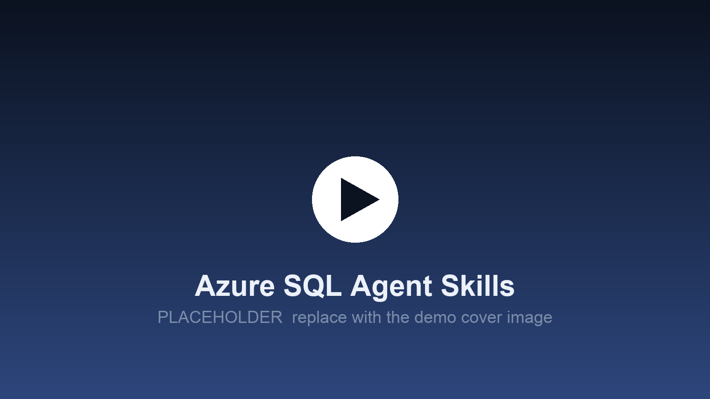

# Microsoft SQL

From the Microsoft SQL product team. Build AI-ready apps on Azure SQL Database with vector search, RAG, REST APIs, serverless functions, passwordless auth, and the ORMs you already use.

[](https://learn.microsoft.com/azure/azure-sql/database/)
[](https://agent-plugins.org/specification)
[](https://agentskills.io/)
[](https://aka.ms/sql-agent-skills-feedback)
[](../../discussions)
[](https://skills.sh/microsoft/microsoft-sql)

<!-- PLACEHOLDER. Replace docs/assets/img/skills-cover.png with the real demo cover,
     and point both links below at the video. -->
<a href="https://learn.microsoft.com/azure/azure-sql/database/">
  
</a>

<a href="https://learn.microsoft.com/azure/azure-sql/database/">**Watch the demo**</a>

Agent skills are folders of instructions and references that an agent discovers and loads on its own, when the task calls for them. You install them once and then keep working normally. There is no new command to learn and no prompt to remember.

These follow the [Agent Skills](https://agentskills.io/) format, and the repository root is a portable [Agent Plugins 1.0.0](https://agent-plugins.org/specification) package, so any conforming client can install the whole set straight from this repository.

## Installation

### Install every skill

```bash
npx skills add microsoft/microsoft-sql
```

### Install one skill

```bash
npx skills add microsoft/microsoft-sql --skill connect-to-azure-sql
```

### GitHub CLI

```bash
gh skill install microsoft/microsoft-sql --all --agent claude-code
```

Choose your agent with `--agent`, for example `github-copilot` or `cursor`.

### Agent Plugins clients

The repository root is an Agent Plugins package. [`plugin.json`](plugin.json) declares it and the skills are the directories under [`skills/`](skills/), so a conforming client installs this repository directly with no per-tool manifest. That covers Visual Studio Code, GitHub Copilot, Cursor, Codex and other clients that implement the specification.

### Claude Code plugin

Claude Code uses its own plugin format rather than Agent Plugins, so it has its own path:

```bash
claude plugin marketplace add microsoft/microsoft-sql
```

```bash
claude plugin install microsoft@microsoft-sql
```

### GitHub Copilot CLI plugin

```bash
copilot plugin marketplace add microsoft/microsoft-sql
```

```bash
copilot plugin install microsoft@microsoft-sql
```

Visual Studio Code loads plugins installed this way, so the same two commands cover it.

### Codex plugin

```bash
codex plugin marketplace add microsoft/microsoft-sql
```

```bash
codex plugin add microsoft@microsoft-sql
```

### Repository-committed skills

Committed to `.github/skills/` in your own repository, skills also reach the GitHub Copilot coding agent and Visual Studio agent mode with no install step at all.

## Available skills

<!-- BEGIN GENERATED CATALOG -->
<!-- GENERATED by scripts/generate.mjs from catalog/catalog.json. Do not edit by hand; the parity gate will fail. -->

**57 skills** are installed by the commands above. Expand a group to see what each one does.

<details>
<summary><strong>Provisioning and local dev</strong> (3)</summary>

**[dev-container-templates](skills/dev-container-templates/SKILL.md)**

Sets up local development from the Azure SQL Database dev container templates in microsoft/azuresql-devcontainers (.NET, .NET Aspire, Node.js, Python), each with a sample database and schema loaded.

**[provision-azure-sql-db](skills/provision-azure-sql-db/SKILL.md)**

Creates an Azure SQL Database and returns a connection string that actually works, covering the free offer and paid tiers, the firewall rule, and Microsoft Entra-only administration.

**[provision-hyperscale](skills/provision-hyperscale/SKILL.md)**

Puts a real workload on the Hyperscale service tier of Azure SQL Database: when to choose it, how to size it, and how to convert an existing database without walking through a door that does not open again.

</details>

<details>
<summary><strong>Drivers and connectivity</strong> (5)</summary>

**[connect-from-dotnet](skills/connect-from-dotnet/SKILL.md)**

Connects a .NET application to Azure SQL Database with Microsoft.Data.SqlClient: which package references are required, the encryption defaults and what changed, connection pooling and the keys that split a pool, and managed identity or other Microsoft Entra ID modes.

**[connect-from-python](skills/connect-from-python/SKILL.md)**

Connects a Python application to Azure SQL Database, choosing between Microsoft's first-party mssql-python driver and the incumbent pyodbc, and covering driver installation, the connection string each one wants, connection pooling, and Microsoft Entra ID including token-based authentication.

**[connect-from-typescript-and-node](skills/connect-from-typescript-and-node/SKILL.md)**

Connects a TypeScript or JavaScript application to Azure SQL Database with the mssql package over tedious: which packages to install, where the connection pool has to live, how to type query results, and how to authenticate with Microsoft Entra ID without a password.

**[connect-to-azure-sql](skills/connect-to-azure-sql/SKILL.md)**

Connects an application to Azure SQL Database correctly and durably: chooses the Microsoft driver for the language, sets encryption and certificate validation, sizes the connection pool against the worker limit rather than the session limit, and makes retry part of the first version of the code instead of later hardening.

**[diagnose-connection-errors](skills/diagnose-connection-errors/SKILL.md)**

Diagnoses an Azure SQL Database connection refused before a credential was evaluated, reading the error number and its severity to name the layer that refused: the IP firewall (40615), a virtual network rule (40914), public network access disabled (47073, 42101), the gateway declining a server name or login format (40532, 40531), a TLS version under the server minimum (47072), plus the transport, pre-login, timeout and certificate failures that carry no usable number.

</details>

<details>
<summary><strong>Schema and ORM</strong> (4)</summary>

**[design-azure-sql-schema](skills/design-azure-sql-schema/SKILL.md)**

Designs tables for Azure SQL Database so the first index, the first long value or the first failover does not force a rebuild.

**[ef-core-azure-sql](skills/ef-core-azure-sql/SKILL.md)**

Configures Entity Framework Core against Azure SQL Database, where retry is on by default and that redefines a transaction: the execution strategy refuses a user-initiated transaction, and the wrapper the exception tells you to write replays the whole unit, so a fault arriving after the commit writes the row twice and reports success.

**[prisma-azure-sql](skills/prisma-azure-sql/SKILL.md)**

Uses Prisma ORM against Azure SQL Database on JavaScript and TypeScript, inside the connector's real limits: no Json type, no enums, no scalar lists, a default string length that quietly breaks keys, a connection URL that moved out of the schema file in Prisma 7, and a migration workflow that succeeds locally and is refused in the cloud.

**[sqlalchemy-azure-sql](skills/sqlalchemy-azure-sql/SKILL.md)**

Uses SQLAlchemy correctly against Azure SQL Database, where the dialect appends an OUTPUT clause to INSERT statements and that single clause explains two failures agents never connect: a hard error on any table carrying a trigger, and fast_executemany appearing to do nothing.

</details>

<details>
<summary><strong>T-SQL correctness and patterns</strong> (3)</summary>

**[t-sql-correctness](skills/t-sql-correctness/SKILL.md)**

Writes T-SQL that returns the right answer on Azure SQL Database, and catches the statements that return a wrong answer with no error at all: NULL compared using = or <> or NOT IN, ISNULL and COALESCE differing in return type, integer division truncating, a string variable declared with no length, and a session where QUOTED_IDENTIFIER is OFF.

**[t-sql-json-and-openjson](skills/t-sql-json-and-openjson/SKILL.md)**

Queries and stores JSON on Azure SQL Database using the native json type, a JSON index, and OPENJSON with an explicit WITH schema, instead of the older nvarchar(max) plus JSON_VALUE pattern the training data is full of.

**[t-sql-upserts-merge](skills/t-sql-upserts-merge/SKILL.md)**

Writes an upsert for Azure SQL Database that is still correct when two sessions run it at the same moment, and refuses the MERGE shapes that lose rows.

</details>

<details>
<summary><strong>Identity and access (Entra ID)</strong> (1)</summary>

**[entra-id-auth](skills/entra-id-auth/SKILL.md)**

Takes an application identity to a working passwordless connection to Azure SQL Database, and diagnoses it when that fails: sets the Microsoft Entra administrator, creates the database user for a managed identity or service principal, grants roles, and writes the driver's authentication keyword.

</details>

<details>
<summary><strong>Security and safe SQL</strong> (2)</summary>

**[prevent-sql-injection](skills/prevent-sql-injection/SKILL.md)**

Handles SQL injection on Azure SQL Database past what an agent already gets right: a typed sp_executesql parameter matches nothing where the same input concatenated into EXEC() returns every row; QUOTENAME returns NULL above 128 characters, so the batch built from it becomes NULL and runs as a silent no-op at no severity; one CASE over columns of different types in a dynamic ORDER BY fails only for the sort key selecting the lower-precedence branch; dynamic SQL breaks the ownership chain, so EXECUTE AS decides what a statement may touch and who the engine thinks is running it; and Always Encrypted refuses a literal with Msg 206.

**[rls-multi-tenant](skills/rls-multi-tenant/SKILL.md)**

Builds tenant isolation on Azure SQL Database that a test can prove, with a row level security policy whose filter predicate and block predicate are written together, because a filter alone still accepts a cross-tenant write and then hides the row from the application that made it.

</details>

<details>
<summary><strong>Schema change and CI/CD</strong> (3)</summary>

**[github-actions-for-sql](skills/github-actions-for-sql/SKILL.md)**

Ships schema changes to Azure SQL Database from a GitHub Actions workflow with `azure/sql-action`: building the database project or publishing a prebuilt dacpac, federating the workflow's token so no database password or client secret is stored, getting a runner with a changing address through the server firewall, and gating the deployment on an environment.

**[schema-migrations-safely](skills/schema-migrations-safely/SKILL.md)**

Decides whether a schema change is safe to apply to a live Azure SQL Database, and rewrites the migration script so it is.

**[sql-database-projects](skills/sql-database-projects/SKILL.md)**

Builds and publishes a SQL database project against Azure SQL Database: the SDK-style `.sqlproj` on `Microsoft.Build.Sql`, the target platform that decides what the build actually validates, pre and post deployment scripts, the refactorlog, and code analysis.

</details>

<details>
<summary><strong>Azure patterns and deploy</strong> (1)</summary>

**[deploy-app-to-azure](skills/deploy-app-to-azure/SKILL.md)**

Takes a working local application and its Azure SQL Database to Azure with the Azure Developer CLI, reading its infrastructure rather than inheriting it.

</details>

<details>
<summary><strong>APIs and application patterns</strong> (3)</summary>

**[azure-functions-sql-bindings](skills/azure-functions-sql-bindings/SKILL.md)**

Wires Azure Functions to Azure SQL Database with the SQL input and output bindings and the SQL trigger, including the change tracking the trigger cannot run without and the identity permissions the trigger needs beyond the ones the bindings need.

**[build-app-on-azure-sql](skills/build-app-on-azure-sql/SKILL.md)**

Sequences the work of standing up a new application on Azure SQL Database and routes each decision to the skill that owns it.

**[dab-rest-and-graphql](skills/dab-rest-and-graphql/SKILL.md)**

Decides what a Data API builder configuration on Azure SQL Database actually publishes and to whom, at the version 2.0 model: entities generated from patterns, roles that inherit upward, row-filtering database policies, relationships, and the passwordless connection a hosted run needs.

</details>

<details>
<summary><strong>AI, vector and RAG</strong> (5)</summary>

**[embeddings-and-external-models](skills/embeddings-and-external-models/SKILL.md)**

Generates embeddings and chunks inside Azure SQL Database with CREATE EXTERNAL MODEL, AI_GENERATE_EMBEDDINGS, AI_GENERATE_CHUNKS and sp_invoke_external_rest_endpoint, covering the database scoped credential naming rule, the permissions, the dimension budget that decides which embedding model fits, and the outbound allowlist.

**[langchain-and-llamaindex-on-azure-sql](skills/langchain-and-llamaindex-on-azure-sql/SKILL.md)**

Wires LangChain or LlamaIndex to Azure SQL Database from Python: the SQL toolkits, their text to SQL prompts, the langchain-sqlserver vector store, and the guardrails neither framework enforces.

**[rag-local-with-container](skills/rag-local-with-container/SKILL.md)**

Answers whether a retrieval augmented generation prototype proved against the local Azure SQL Database container still holds in Azure SQL Database, and names the three things that do not survive the move.

**[rag-on-azure-sql](skills/rag-on-azure-sql/SKILL.md)**

Builds retrieval augmented generation end to end on Azure SQL Database: chunking source text, storing embeddings with the provenance that makes them re-runnable, retrieving with the filter and the permission check inside the same query, and grounding an answer on what came back.

**[vector-search-azure-sql](skills/vector-search-azure-sql/SKILL.md)**

Stores and searches vectors natively in Azure SQL Database: the vector type, VECTOR_DISTANCE, the 1998 dimension ceiling, the DiskANN vector index, and the long list of places a vector column is refused.

</details>

<details>
<summary><strong>Performance and diagnostics</strong> (5)</summary>

**[capture-with-extended-events](skills/capture-with-extended-events/SKILL.md)**

Creates, starts, reads back and drops a database-scoped Extended Events session on Azure SQL Database, and names the ways such a session reports success while capturing nothing.

**[diagnose-blocking-and-deadlocks](skills/diagnose-blocking-and-deadlocks/SKILL.md)**

Finds who is blocking whom on Azure SQL Database right now, and reads a completed deadlock graph out of the database-scoped Extended Events session that captured it.

**[diagnose-resource-pressure](skills/diagnose-resource-pressure/SKILL.md)**

Answers whether an Azure SQL Database is slow because of CPU, data or log IO, memory, or a worker and session limit, and what to actually do about each.

**[diagnose-slow-query](skills/diagnose-slow-query/SKILL.md)**

Triages a slow Azure SQL Database query into one of four causes before anyone touches an index or a service tier: volatile, duration swings across executions; blocked, waiting on another session right now; regressed, a worse plan replaced a good one; or growing, duration rises with data volume over time.

**[read-execution-plan](skills/read-execution-plan/SKILL.md)**

Retrieves an Azure SQL Database execution plan, estimated or actual, and pulls out the small set of facts that explain slowness: operators, estimated versus actual row counts, warnings, missing-index hints, and the memory grant, instead of returning the whole plan XML.

</details>

<details>
<summary><strong>Operate and recover</strong> (1)</summary>

**[restore-and-recover](skills/restore-and-recover/SKILL.md)**

Recovers an Azure SQL Database after data loss, an accidental drop, or a bad deployment, using point-in-time restore, geo-restore, and long-term retention.

</details>

<details>
<summary><strong>Data movement</strong> (2)</summary>

**[bulk-load-and-bulk-copy](skills/bulk-load-and-bulk-copy/SKILL.md)**

Loads data into Azure SQL Database fast by choosing the right route: BULK INSERT and OPENROWSET(BULK ...) from Azure Blob Storage, bcp, .NET SqlBulkCopy, and the Python and Node.js bulk-copy equivalents.

**[sqlpackage-import-export](skills/sqlpackage-import-export/SKILL.md)**

Moves a whole Azure SQL Database as a portable file with SqlPackage, choosing between the Extract, Publish, Export and Import actions, stating what each one carries, and giving the command line for each.

</details>

<details>
<summary><strong>Azure SQL Database container</strong> (17)</summary>

**[azuresql-db-auth](skills/azuresql-db-auth/SKILL.md)**

Connects an app to the Azure SQL Database container securely, with a least-privilege database user instead of the sa login, the right auth method per environment, and safe handling of the connection secret.

**[azuresql-db-ci](skills/azuresql-db-ci/SKILL.md)**

Runs integration tests against the Azure SQL Database container (Private Preview, local engine) in CI.

**[azuresql-db-connections](skills/azuresql-db-connections/SKILL.md)**

Makes an app's database connections reliable against the local Azure SQL Database container (Private Preview) and, unchanged, against Azure SQL Database in the cloud: connection pooling plus retry/transient-fault handling.

**[azuresql-db-container](skills/azuresql-db-container/SKILL.md)**

Runs the Azure SQL Database container (the Azure SQL Database engine) locally (Private Preview): the real PaaS engine where SERVERPROPERTY('EngineEdition') returns 5 and Edition is 'SQL Azure'.

**[azuresql-db-dab](skills/azuresql-db-dab/SKILL.md)**

Stands up an instant no-code REST + GraphQL API over the local Azure SQL Database container using Microsoft Data API Builder (DAB).

**[azuresql-db-faq](skills/azuresql-db-faq/SKILL.md)**

Answers questions about what the Azure SQL Database container (Private Preview) can and cannot do, and WHY it differs from Azure SQL Database in the Microsoft Azure cloud.

**[azuresql-db-feedback](skills/azuresql-db-feedback/SKILL.md)**

Reports a bug or files feedback about the azuresql-db-* agent skills themselves, or about the Azure SQL Database container (the local Azure SQL Database engine, Private Preview).

**[azuresql-db-from-sql-server](skills/azuresql-db-from-sql-server/SKILL.md)**

Migrates a local SQL Server setup to the Azure SQL Database container for Azure-faithful local development.

**[azuresql-db-functions](skills/azuresql-db-functions/SKILL.md)**

Builds a serverless API and event-driven handlers over the local Azure SQL Database container using Azure Functions with the Azure SQL bindings.

**[azuresql-db-import](skills/azuresql-db-import/SKILL.md)**

Imports an existing Azure SQL Database or SQL Server schema and data INTO the local Azure SQL Database container using SqlPackage.

**[azuresql-db-local-to-cloud](skills/azuresql-db-local-to-cloud/SKILL.md)**

Proves that code built and tested against the local Azure SQL Database container runs unchanged against Azure SQL Database in the cloud, with only the connection string changing.

**[azuresql-db-rag](skills/azuresql-db-rag/SKILL.md)**

Builds local vector search, RAG, embeddings, and semantic search on the Azure SQL Database container using the native VECTOR type and VECTOR_DISTANCE.

**[azuresql-db-scaffold](skills/azuresql-db-scaffold/SKILL.md)**

Scaffolds a NEW app (.NET Aspire, FastAPI, Next.js, NestJS) wired to the local Azure SQL Database container as its default dev database.

**[azuresql-db-schema-migration](skills/azuresql-db-schema-migration/SKILL.md)**

Runs database schema migrations against the local Azure SQL Database container so the same migrations apply identically on the local engine and in the Azure cloud.

**[azuresql-db-seed](skills/azuresql-db-seed/SKILL.md)**

Populates the local Azure SQL Database container's database (appdb) with realistic sample/test data so a developer has something to build against.

**[azuresql-db-sidecar](skills/azuresql-db-sidecar/SKILL.md)**

Adds the Azure SQL Database container as a sidecar service in an existing Docker Compose stack or Dev Container.

**[azuresql-db-testing](skills/azuresql-db-testing/SKILL.md)**

Writes integration tests that run IN CODE against a real Azure SQL Database container, spun up per test or per suite with Testcontainers and torn down after.

</details>

<details>
<summary><strong>Docs and feedback</strong> (2)</summary>

**[azure-sql](skills/azure-sql/SKILL.md)**

Orients an agent starting work on Azure SQL Database and hands the task to the catalog skill that owns it.

**[skill-feedback](skills/skill-feedback/SKILL.md)**

Turns a defect in an Azure SQL agent skill, or in this catalog itself, into a redacted, prefilled GitHub issue the user reviews and submits.

</details>

A further 85 skills are planned. The full list, with the domain and intent of each, is in [catalog/catalog.json](catalog/catalog.json).

<!-- END GENERATED CATALOG -->

## Examples

Skills load themselves when the work matches. Ask for what you want in your own words:

```text
Connect my Node app to Azure SQL Database without a password
```

```text
Why does my first query after an idle period fail with 40613
```

```text
Set up Data API builder over these tables
```

```text
My Azure Functions SQL trigger never fires and there is no error
```

```text
Write a safe upsert for this table
```

```text
Add vector search to this table and make it use the index
```

```text
Deploy this app to Azure with azd and no connection string secret
```

## Scope

**Cloud** means Azure SQL Database. Not Managed Instance, not Fabric SQL, not SQL Server on virtual machines. **Local** means the Azure SQL Database container. The on-premises engine appears only in the migration skills, and only as the source.

That line is load-bearing rather than tidy. Several AI functions exist only in Fabric and are routinely hallucinated into Azure SQL Database, which is exactly the kind of confident error these skills exist to correct.

## Feedback

A skill that gives wrong or outdated guidance is a bug, and the fastest fix starts with a good report.

- **A skill said something wrong, stale or unhelpful:** [open skill feedback](https://aka.ms/sql-agent-skills-feedback)
- **Ask a question, share what you built, suggest a skill:** [Discussions](../../discussions)

The `skill-feedback` skill can assemble the report from context your agent already has, redact secrets and hand it to you to submit. It never submits anything on its own.

If the **product** misbehaved rather than the skill, that belongs in the Azure SQL Database feedback channels. Rule of thumb: if the skill said the right thing and it still failed, that is a product issue rather than a skill issue.

## Contributing

Pull requests are welcome. Read [CONTRIBUTING.md](CONTRIBUTING.md) first: skills follow conventions that are easy to break in ways that only show up later, when an agent silently stops loading one.

## Trademarks

This project may contain trademarks or logos for projects, products, or services. Authorized use of Microsoft trademarks or logos is subject to and must follow [Microsoft's Trademark & Brand Guidelines](https://www.microsoft.com/legal/intellectualproperty/trademarks/usage/general). Use of Microsoft trademarks or logos in modified versions of this project must not cause confusion or imply Microsoft sponsorship. Any use of third-party trademarks or logos are subject to those third-party's policies.
