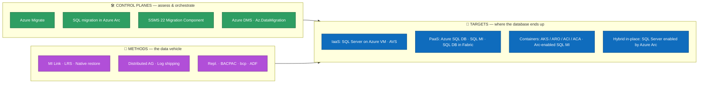
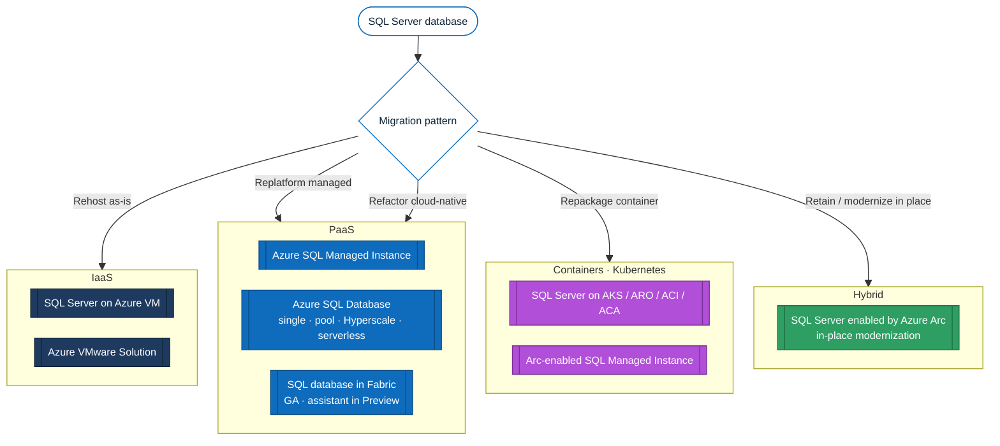
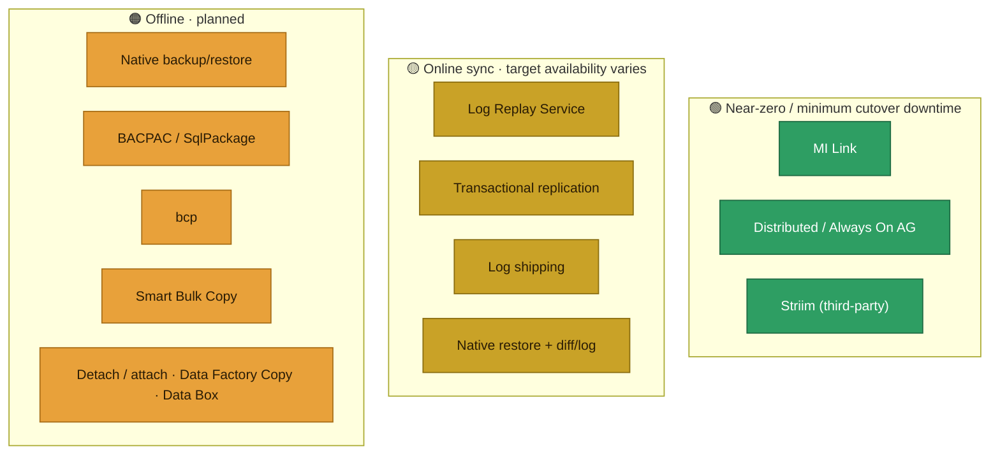
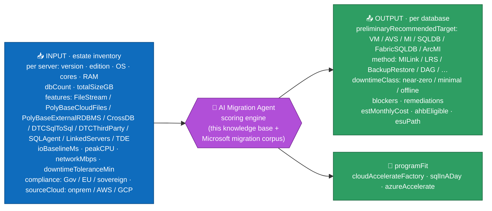

# Migrating SQL Server to Azure — exhaustive inventory of targets, methods and tools

> **Goal.** Exhaustively list every way and every tool to migrate a SQL Server database to an Azure service (all PaaS, including containers) or a VM (Azure VM / Azure VMware Solution).
>
> **Audience.** Partners, architects, and customer DBAs — usable in pre-sales and as the knowledge base behind the *SQL in a Day* AI Migration Agent ([§14](#14-fy27-sql-motion-context--ai-migration-agent)).
>
> **Verification.** Tool retirements, version requirements and target families were cross-checked against Microsoft Learn and product announcements (current as of August 2026). Links are gathered in [§16 Sources](#16-sources-microsoft-learn).
>
> **Version.** v3.14 — 11 September 2026. Change history in [§17 Document version & changelog](#17-document-version--changelog).

> [!IMPORTANT]
> **2025–2026 tooling reset — read this first.**
> - **Data Migration Assistant (DMA)** is RETIRED (16 July 2025).
> - **Azure Data Studio (ADS)** is RETIRED (28 February 2026). The Azure SQL Migration extension has no separately announced retirement date; do not anchor new runbooks on it because the replacement experiences are SSMS 22, Azure Arc migration and modern DMS.
> - The new entry point is the **SSMS 22 Migration Component** (assess + migrate from SSMS), complemented by SQL Server migration in Azure Arc (portal, with Copilot — now **GA to both Azure SQL MI and SQL Server on Azure VM**) and Azure Database Migration Service (DMS).
> - Modern **DMS** supports offline-only migration to Azure SQL Database (online / minimal-downtime is available for Managed Instance and SQL VM targets, per the [DMS supported-scenarios](https://learn.microsoft.com/en-us/azure/dms/resource-scenario-status) matrix).
> - **Azure DMS *classic*** SQL Server scenarios have been absorbed into the current DMS portal experience — use modern DMS (an Azure resource, via portal / PowerShell / CLI).

---

## 1. Why migrate in 2026 (the short "why now")

- **AI runs on data.** Modern, managed databases are the foundation; SQL Server 2025 / Azure SQL add a native `vector` type + functions, **DiskANN** vector indexing (high-throughput ANN search), native `json`, and zero-ETL **Fabric Mirroring** (analytics on OneLake with no pipelines) — making the estate AI-ready and improving migration (enhanced distributed AG).
- **End-of-support pressure.** Out-of-support SQL Server/Windows versions push modernization; the SQL Server Extended Security Updates programme now covers SQL Server 2014 and SQL Server 2016 only, and ESU is free on Azure VMs / AVS for SQL Server 2014. SQL Server 2016 is paid everywhere (including Azure VM) and non-Azure environments use Azure Arc for ESU subscription/billing — this changes the *stay vs migrate* math.
- **Cost levers.** Azure Hybrid Benefit (AHB) applies to Azure SQL Database General Purpose / Business Critical in the vCore provisioned compute tier, Managed Instance and VM (not Fabric SQL DB, DTU or serverless). Hyperscale is a creation-date cohort: only single databases with provisioned compute created before 15 December 2023 can apply AHB, and only until December 2026; databases created on or after that date have no SQL software license fee to offset.
- **Partner leverage.** Sharing a deal with a partner increases win rate and deal size; programs like Cloud Accelerate Factory and SQL in a Day industrialize delivery ([§14](#14-fy27-sql-motion-context--ai-migration-agent)). Commercial & funding levers are detailed in [§15](#15-commercial-levers--funding-programs-fy27).
- **Concrete forcing function.** SQL Server 2016 left extended support on 15 July 2026 and is now in ESU Year 1 (15 Jul 2026–13 Jul 2027; Year 3 ends 17 Jul 2029). "Stay" means paid ESU, and SQL Server 2016 requires a paid ESU subscription even on Azure VM.

| Version | Extended End of Support | Status (Jul 2026) |
| --- | --- | --- |
| SQL Server 2012 | 12 Jul 2022 — ESU ended Jul 2025 | ❌ Out of support |
| SQL Server 2014 | 10 Jul 2024 — ESU Y3 ends 13 Jul 2027 | ⚠️ Out of support (ESU window) |
| SQL Server 2016 | 15 Jul 2026 — ESU Y1 15 Jul 2026–13 Jul 2027; Y3 ends 17 Jul 2029 | 🔴 Out of support — ESU Y1 |
| SQL Server 2017 | 13 Oct 2027 | ✅ Extended support |
| SQL Server 2019 | 9 Jan 2030 | ✅ |
| SQL Server 2022 | 12 Jan 2033 | ✅ |
| SQL Server 2025 | GA 18 Nov 2025 — extended end 7 Jan 2036 | ✅ Latest |

> **Dates are Microsoft Lifecycle Extended End Dates**, quoted as published ([2014](https://learn.microsoft.com/en-us/lifecycle/products/sql-server-2014), [2016](https://learn.microsoft.com/en-us/lifecycle/products/sql-server-2016), [2017](https://learn.microsoft.com/en-us/lifecycle/products/sql-server-2017), [2019](https://learn.microsoft.com/en-us/lifecycle/products/sql-server-2019), [2022](https://learn.microsoft.com/en-us/lifecycle/products/sql-server-2022), [2025](https://learn.microsoft.com/en-us/lifecycle/products/sql-server-2025)). Microsoft records them at 06:59:59 PT on the stated day, so the last covered update ships on the Patch Tuesday before it — 14 July 2026 for SQL Server 2016. Quote the Lifecycle date in a customer conversation, and the Patch Tuesday only if someone asks which update was the last.

> Windows Server often sits under SQL Server — **WS 2012/2012 R2** is out of support (ESU to Oct 2026), WS 2016 EOS ~Jan 2027. Factor the OS into the move.

---

## 2. Taxonomy — separate targets, control planes, and methods

The single most common mistake is to mix these three layers. Keep them distinct:

- **Targets** = runtime destinations (where the DB lives).
- **Control planes / experiences** = how you assess, recommend and orchestrate (Azure Migrate, Arc, SSMS 22, DMS). Azure Arc-enabled SQL *Server* is a control plane, not a runtime target.
- **Methods** = the actual data-movement vehicle (MI Link, LRS, backup/restore, replication…).

---

## 3. The Azure targets (8 families)

| # | Target | Layer | When to choose it | Compatibility | Doc |
| --- | --- | --- | --- | --- | --- |
| 1 | SQL Server on Azure VM | IaaS | Faithful lift & shift: OS / file-system control, exact version, FileStream/FileTable, PolyBase, cross-instance DTC, third-party agents. | Full | [overview](https://learn.microsoft.com/en-us/data-migration/sql-server/virtual-machines/overview) |
| 2 | Azure VMware Solution (AVS) | IaaS | Zero-refactor data-center exit for existing VMware estates; keeps FCI and Always On AG; migrate with VMware HCX / vMotion. **Licensing has a deadline: see §15.1.** | Full | [AVS](https://learn.microsoft.com/en-us/azure/azure-vmware/introduction) |
| 3 | Azure SQL Managed Instance | PaaS | Managed lift-and-shift: keep instance objects (logins, SQL Agent, server triggers, cross-DB, linked servers), native vNet. Tiers GP / BC / Next-gen GP *(GA since Nov 2025 — Elastic SAN backend: 500 DBs, 128 vCores, 32 TB, 80K IOPS, 192 MB/s log, 3–4 ms latency, configurable IOPS/memory; ~5x better price-per-DB by density)*. **Zone redundancy on Next-gen GP is public preview** — the tier is GA, that capability is not, so do not count it as available when preview services are unacceptable. Free offer: 1 instance / 12 months. ⚠️ No Hyperscale on MI. | ~Near-full (instance) | [overview](https://learn.microsoft.com/en-us/data-migration/sql-server/managed-instance/overview) |
| 4 | Azure SQL Database | PaaS | Cloud-native app / microservice. Models: single DB / elastic pool; tiers GP / BC / Hyperscale; purchasing vCore / DTU / serverless. Hyperscale scales to 128 TB (large / HTAP); serverless for intermittent; elastic pools for consolidation. Free offer: 10 serverless DBs for the subscription lifetime. | Database surface (no instance-level) | [overview](https://learn.microsoft.com/en-us/data-migration/sql-server/database/overview) |
| 5 | SQL database in Fabric | PaaS | Fabric-native OLTP unified with OneLake. The **target itself is GA**; only the Fabric Migration Assistant is Preview, with tool limits (DACPAC schema ≤ 20 MB, on-prem data gateway only, no Private Link). The target also accepts T-SQL, transactional replication, Fabric pipelines / Data Factory copy jobs, Dataflow Gen2, and other TDS-capable tools, so assistant limits alone must not eliminate it. Assess the database surface before committing an enterprise OLTP workload. | Subset of the SQL Server surface | [SQL database in Fabric](https://learn.microsoft.com/en-us/fabric/database/sql/overview) · [Migration Assistant *(Preview)*](https://learn.microsoft.com/en-us/fabric/database/sql/migration-assistant) |
| 6 | SQL Server in containers — AKS / ARO / ACI / ACA | Container | Full control of the engine in a container (dev/test, edge, custom). Pod + PersistentVolume; HA via the Kubernetes scheduler. | High — SQL on Linux (no FILESTREAM/FileTable, SSRS/SSAS/SSIS, ML Services; SQL Agent off by default) | [SQL on Kubernetes](https://learn.microsoft.com/en-us/sql/linux/quickstart-sql-server-containers-kubernetes) |
| 7 | Azure Arc-enabled SQL Managed Instance | Container (PaaS) | Managed SQL MI engine on any Kubernetes (AKS, ARO, EKS, GKE, OpenShift) via `kubectl`+CRD. Sovereignty / edge / multi-cloud. | ~Same as SQL MI | [create Arc SQL MI](https://learn.microsoft.com/en-us/azure/azure-arc/data/create-sql-managed-instance) |
| 8 | SQL Server enabled by Azure Arc | Hybrid (control plane) | Not a runtime target — the bootstrap pillar: connect on-prem SQL *without touching it* → weekly continuous assessment, blocker detection, ESU, PAYG (OpEx) licensing, governance, and a portal Copilot-assisted Database migration — to **Azure SQL MI** (MI Link / LRS) and, **GA since July 2026**, to **SQL Server on Azure VM** (native backup/restore). Arc-enabled SQL Server 2014+ overall; path-specific floors apply (MI Link: SQL Server 2016+, Windows Server only on this Arc path; use the conservative 2014+ Arc floor for LRS because Microsoft Learn is inconsistent — see §9). | n/a | [Arc migration](https://learn.microsoft.com/en-us/sql/sql-server/azure-arc/migration-overview) |

> **Lift & shift is not VM-only.** Both SQL Server on Azure VM (IaaS) and Azure SQL Managed Instance (managed PaaS) are valid lift-and-shift targets. Since 2024, MI compatibility (SQL Agent, cross-DB queries, linked servers…) makes it the default *managed* lift-and-shift.

---

## 4. Control planes & assessment experiences

| Tool / experience | Role | Status (2026) | Notes |
| --- | --- | --- | --- |
| [Azure Migrate](https://learn.microsoft.com/en-us/azure/migrate/how-to-create-azure-sql-assessment) | Discovery / assessment / sizing / business case at scale | GA (+ Arc-based agentless discovery, Preview) | Appliance (VMware/Hyper-V/Physical) or import-based or Arc-based. Right-sizes SQL DB / MI / VM. |
| [Azure Copilot Migration Agent](https://learn.microsoft.com/en-us/azure/migrate/azure-copilot-migration-agent) | **Planning only**: analyses existing Azure Migrate data for readiness, strategy, ROI and landing-zone design | Preview | Not a data-movement method and not an assessment collector — it reasons over data Azure Migrate already gathered, so it presupposes an assessment rather than replacing one. Distinct from the SQL in a Day advisor skill in this repository, which interviews a person and reads no estate data. |
| [SQL Server migration in Azure Arc](https://learn.microsoft.com/en-us/sql/sql-server/azure-arc/migration-overview) | Portal-driven assess + migrate for any Arc-enabled SQL Server | GA; **MI and VM targets both GA** | Copilot-assisted; targets **Azure SQL MI** (MI Link / LRS) and — **GA July 2026** — **SQL Server on Azure VM** ([lift-and-shift, native backup/restore](https://learn.microsoft.com/en-us/sql/sql-server/azure-arc/migrate-to-sql-server-on-azure-vms)); continuous assessment; Arc-enabled SQL Server 2014+ overall, with MI Link requiring SQL Server 2016+ and, on this Arc-driven path, **Windows Server only**. The Azure Arc portal MI wizard can select up to 10 databases per batch with Azure Extension for SQL Server ≥ 1.1.3348.364 (earlier versions: one database at a time); this is an Arc wizard batch limit, not MI Link capacity. |
| [SSMS 22 Migration Component](https://learn.microsoft.com/en-us/ssms/migrate/migrate-sql-server-azure-sql) | DBA-first entry point: assess + launch a recommended migration path from SSMS | GA (Windows-only) | Replaces DMA-era workflows and complements the ADS migration extension. **Migrate SQL Server assesses SQL Server instances and migrates them to Azure SQL today.** Backup/restore, MI Link, DMS. Arc-enabled sources can reuse readiness assessments already collected through Azure Arc. |
| [Azure DMS (modern)](https://learn.microsoft.com/en-us/azure/dms/dms-overview) | Managed migration orchestration (Azure resource · portal / PowerShell / CLI) | GA | Use the modern DMS — former DMS *classic* SQL scenarios are absorbed into the current portal experience. Offline-only to Azure SQL DB; online/minimal-downtime to MI / SQL VM (MI Link preferred for MI). |
| [PowerShell `Az.DataMigration` / Azure CLI](https://learn.microsoft.com/en-us/powershell/module/az.datamigration/) | Automate DMS at scale (CI/CD) | GA | Often the only viable path beyond ~50 databases. |
| [SSMA](https://learn.microsoft.com/en-us/sql/ssma/sql-server-migration-assistant) | Heterogeneous conversion (schema/code/data) | GA | Oracle / Sybase / DB2 / MySQL / Access → Azure SQL. Not for homogeneous SQL→SQL. |
| [Database Experimentation Assistant (DEA)](https://learn.microsoft.com/en-us/previous-versions/sql/dea/database-experimentation-assistant-overview) | Capture + replay a production workload on the target to validate performance *before* cutover | Retired 15 December 2024 | Replaced by a documented validation stack: capture with Extended Events (SQL Trace/Profiler deprecated), replay with RML Utilities / OStress, then analyse with Query Store and DMVs. The *concept* (catch plan/compat regressions before cutover) remains valuable; the MS tool itself is retired. |

> [!NOTE]
> **Retired — do not use in new runbooks:** DMA (16 Jul 2025) and Azure Data Studio itself (28 Feb 2026). The Azure SQL Migration extension has no separately announced retirement date, but migration work should continue via SSMS 22 / Azure Arc / modern DMS / `Az.DataMigration` CLI. SQL Data Sync retires 30 Sep 2027 — don't build new sync/migration on it (use ADF, transactional replication or AG).

### 4.1 Microsoft tooling by source → target (assess · data · schema)

Common tooling per source/target combination (homogeneous and heterogeneous); third-party CDC options are labelled separately from current Microsoft migration guidance:

| Source | Target | Assess | Data migration | Schema |
| --- | --- | --- | --- | --- |
| SQL Server (Arc-enabled) | Azure SQL MI | SQL migration in Azure Arc | SQL migration in Azure Arc | Not needed |
| SQL Server (Arc-enabled) | SQL Server on Azure VM | SQL migration in Azure Arc | SQL migration in Azure Arc (native backup/restore) | Not needed |
| SQL Server (not Arc) | Azure SQL VM / MI | Azure Migrate | DMS | Not needed |
| SQL Server | Azure SQL DB | Azure Migrate | STRIIM (online) · DMS (offline) | DMS |
| Sybase | Azure SQL | Azure Migrate | STRIIM | SSMA for Sybase |
| Oracle | Azure SQL | Azure Migrate | STRIIM | SSMA for Oracle |

> GitHub Copilot is applicable as AI-assisted migration tooling (schema/code conversion inside SSMA; app-level via GitHub Copilot App Modernization for .NET / Java). Portfolio & application/code assessment partners complementary to Azure Migrate: Dr Migrate, CAST Highlight, UnifyCloud.

---

## 5. Migration methods per target

Standardized columns (Microsoft Learn style): **Method · Min source · Target/min · Downtime · Key constraints**.

### 5.1 To SQL Server on Azure VM (IaaS rehost)

| Method | Min source | Downtime | Key constraints / notes |
| --- | --- | --- | --- |
| [Azure Migrate (lift & shift)](https://learn.microsoft.com/en-us/azure/migrate/migrate-services-overview) | SQL 2008 SP4 | Online (replication) | Whole VM/instance, incl. FCI and AG; up to ~35,000 VMs. |
| [SQL migration in Azure Arc → SQL VM](https://learn.microsoft.com/en-us/sql/sql-server/azure-arc/migrate-to-sql-server-on-azure-vms) | SQL 2014+ (Arc-enabled) | Offline (backup/restore) | **GA (July 2026):** portal-driven, Copilot-assisted lift-and-shift for Arc-enabled sources — provisions the target Azure VM and runs native backup/restore. A phased on-ramp: rehost now, modernize to SQL MI / SQL DB later. |
| [Azure DMS — offline and online](https://learn.microsoft.com/en-us/azure/dms/dms-overview) | SQL 2008+ | **Both**: offline (one cutover) or **online** (minimal downtime) | Managed orchestration of a backup/restore migration, not a different data path: **DMS never takes its own backups**, it restores the files you supply. Each full, differential and log backup in **its own file**, never appended into one media set. Target SQL Server version/edition must be **at or above the source**, and the VM must be registered with the **SQL Server IaaS Agent extension in Full management mode**. **Online adds** the FULL recovery model and an unbroken log chain. Prefer it over a hand-run restore when the wave is large enough that orchestration, retry and progress tracking earn their setup; prefer the plain restore for a single database and a simple outage. Prerequisites: `P25` offline, `P26` online. |
| [Distributed availability group (DAG)](https://learn.microsoft.com/en-us/data-migration/sql-server/virtual-machines/availability-group-migrate) | SQL 2016 | Near-zero | Reuse on-prem AG; needs AD Domain Services (or workgroup AG + certs) and ports open. |
| [Backup to a file (.bak) + copy](https://learn.microsoft.com/en-us/data-migration/sql-server/virtual-machines/guide) | SQL 2008 SP4 | Offline | Simple, supports > 1 TB; use compression / multi-file split for WAN. |
| [Backup to URL (Azure Blob)](https://learn.microsoft.com/en-us/sql/relational-databases/backup-restore/sql-server-backup-to-url) | SQL 2012 SP1 CU2 | Offline | SQL 2012 SP1 CU2 / 2014: page blob + storage-account credential, 1 TB max. SQL 2016+: block blob + SAS credential, 12.8 TB via striping. For > 1 TB on 2012/2014 use local backup + AzCopy. |
| [Detach & attach (MDF/LDF via Blob)](https://learn.microsoft.com/en-us/sql/relational-databases/databases/database-detach-and-attach-sql-server) | SQL 2008 | Offline | For very large DBs where backup/restore is too slow. |
| [Log shipping](https://learn.microsoft.com/en-us/sql/database-engine/log-shipping/about-log-shipping-sql-server) | SQL 2008 | Minimal | Works on Windows and on Linux; a Linux source or target needs SQL Server Agent enabled and the backup directory exposed through a CIFS/Samba share (P03-006). |
| [Always On AG](https://learn.microsoft.com/en-us/data-migration/sql-server/virtual-machines/availability-group-migrate) | SQL 2012 | Near-zero | Fail an existing AG onto Azure VM replicas. |
| [Convert machine to VHD / Ship hard drive / Azure Data Box](https://learn.microsoft.com/en-us/azure/databox/data-box-overview) | any | Offline | Estate exit with limited WAN; multi-TB `.bak`/`.bacpac` via Data Box. |

### 5.2 To Azure SQL Managed Instance (managed lift-and-shift)

| Method | Min source | Downtime | Key constraints / notes |
| --- | --- | --- | --- |
| [Managed Instance link (MI Link)](https://learn.microsoft.com/en-us/azure/azure-sql/managed-instance/managed-instance-link-feature-overview) | SQL 2016 and later (incl. 2022, 2025; Ent/Std/Dev; host OS supported by that SQL version — Windows Server throughout, Linux from SQL 2017, SQL 2016 Windows-only) | Near-zero (online; <1 minute cutover) | Distributed-AG based; R/O readable target during migration; reverse failback to SQL 2022 / 2025 (DR / Azure exit); one link per database, up to 100 links on General Purpose / Business Critical and up to 500 links on Next-gen General Purpose; requires MI Link network ports below. |
| [Log Replay Service (LRS)](https://learn.microsoft.com/en-us/azure/azure-sql/managed-instance/log-replay-service-migrate) | Standalone LRS: SQL Server 2008–2022 | Online sync; cutover downtime | Full/diff/log → Azure Blob; public endpoint; 30-day max window; target remains RESTORING / NORECOVERY (no reads/writes) until cutover. Cutover restores the final backup: minutes on GP with a small final backup, but potentially hours on Business Critical while replicas are seeded. Supports up to the service-tier database limit (for example 100 GP, 500 Next-gen GP), with 100 simultaneous restores per instance and 150 per subscription. Arc portal migration uses the conservative 2014+ Arc floor; standalone LRS remains 2008–2022. |
| [Native backup & restore (.bak)](https://learn.microsoft.com/en-us/azure/azure-sql/managed-instance/restore-sample-database-quickstart) | SQL 2008 | Offline | Simplest; migrate TDE certificate *before* restore or it fails late; master/msdb restore not supported (script instance objects). |
| [Azure DMS — offline and online](https://learn.microsoft.com/en-us/azure/dms/dms-overview) | SQL 2008+ | **Both**: offline (one cutover) or **online** (minimal downtime) | Managed orchestration of a backup/restore migration: **DMS never takes its own backups**, it restores the files you supply — each backup in **its own file** in an SMB share or Blob container, **never appended**. Provision the target instance first; the source login needs `sysadmin` or `CONTROL SERVER`, and the migration account Contributor on the instance and storage. **Online adds** the FULL recovery model and an unbroken log chain. It is the online option that survives when **MI Link is unavailable** and LRS does not qualify; it is the heavier option when a single database and an accepted outage make native backup/restore sufficient. Prerequisites: `P23` offline, `P24` online. |
| [Transactional replication](https://learn.microsoft.com/en-us/azure/azure-sql/managed-instance/replication-transactional-overview) | SQL Server 2016+ | Online | MI can be a subscriber from SQL Server 2016 and later; exact publisher/distributor/subscriber combinations depend on the MI update policy, so check the supportability matrix. |
| [bcp](https://learn.microsoft.com/en-us/sql/tools/bcp/bcp-utility) | any | Offline | High-speed data-only / partial. |
| [Smart Bulk Copy](https://github.com/Azure-Samples/smartbulkcopy) | any | Offline | Archived Azure-Samples parallel-copy wrapper over bulk copy; data-only / partial. |
| [BACPAC / SqlPackage](https://learn.microsoft.com/en-us/azure/azure-sql/database/database-import) | any | Offline | Smaller DBs / simple. |
| [Azure Data Factory — Copy](https://learn.microsoft.com/en-us/azure/data-factory/connector-azure-sql-managed-instance) | any | Offline / batch | When migration = integration / transformation. |

> **MI Link network ports.** Always open the full documented set, regardless of service tier, update policy, VPN / ExpressRoute / VNet peering, or other connectivity mechanism: on the **SQL Managed Instance subnet NSG**, inbound **5022** and **11000–11999** from the SQL Server IP, and outbound **5022** to the SQL Server IP (Microsoft's summary table states 5022 + 11000–11999 both inbound and outbound for the MI NSG). On the **SQL Server host OS firewall and any corporate firewall**, allow inbound **5022** from the MI subnet /24 and outbound **5022** and **11000–11999** to the MI subnet. Ports **11000–11999** carry the MI-side distributed-AG HADR data-replication channel; the actual MI HADR port is dynamically assigned within the range and can be checked with `sys.dm_hadr_fabric_config_parameters` where `parameter_name = 'HadrPort'` (for example, 11002). MI-side ports cannot be customized; the SQL Server-side endpoint port can. Microsoft’s simplified SQL Server-side table lists only 5022, but the authoritative prose also requires outbound 11000–11999 — follow the prose.

> **MI compatibility nuance — PolyBase and DTC.** PolyBase used only for cloud file access (Azure Blob Storage / ADLS Gen2, CSV/delimited or Parquet through `OPENROWSET(BULK)`, `CREATE EXTERNAL TABLE`, CETAS) is **MI eligible**. PolyBase used to query Oracle, Teradata, MongoDB or another SQL Server through external RDBMS connectors is **MI ineligible**; use SQL Server on Azure VM or Synapse. Homogeneous SQL↔SQL DTC (SQL MI ↔ SQL MI / SQL Server) is **MI eligible** via managed DTC; heterogeneous DTC to a third-party RDBMS is **MI ineligible** and needs SQL VM or refactoring. FILESTREAM / FileTable remains a hard blocker for SQL MI and SQL DB.

### 5.3 To Azure SQL Database (cloud-native refactor)

| Method | Min source | Downtime | Key constraints / notes |
| --- | --- | --- | --- |
| [Azure DMS (offline)](https://learn.microsoft.com/en-us/azure/dms/dms-overview) | SQL 2008+ | Offline | **Offline only for this target.** Online / minimal-downtime DMS exists, but for **SQL MI and SQL VM** — see §5.1 and §5.2 — not for Azure SQL Database. Prerequisites: `P12`. |
| STRIIM (online CDC) | any | Online (near-zero) | Microsoft-recommended online / CDC data migration to Azure SQL DB — fills the gap that DMS is offline-only for SQL DB; pair with DMS for schema. |
| [Transactional replication](https://learn.microsoft.com/en-us/azure/azure-sql/database/replication-to-sql-database) | SQL Server 2016 and later (incl. 2022, 2025) | Online | Azure SQL Database can be a push subscriber only, with snapshot and one-way transactional replication. Peer-to-peer and merge are not supported; replicated tables require primary keys. Article limits include unsupported conversions for `hierarchyid`, FILESTREAM and spatial to MAX types, plus partitioning/index feature limits. |
| [BACPAC / SqlPackage](https://learn.microsoft.com/en-us/azure/azure-sql/database/database-import) | any | Offline | Small/medium; `SqlPackage` for scale. |
| [bcp](https://learn.microsoft.com/en-us/sql/tools/bcp/bcp-utility) | any | Offline | Data-only / bulk. |
| [Smart Bulk Copy](https://github.com/Azure-Samples/smartbulkcopy) | any | Offline | Archived Azure-Samples parallel-copy wrapper; data-only / bulk. |
| [Azure Data Factory — Copy](https://learn.microsoft.com/en-us/azure/data-factory/connector-azure-sql-database) | any | Offline / batch | BI / integration. |

> ❌ **Not supported to Azure SQL Database:** native `.bak` restore, detach/attach, MI Link. SQL Agent → use [Elastic Jobs](https://learn.microsoft.com/en-us/azure/azure-sql/database/elastic-jobs-overview).
>
> 📦 **DACPAC vs BACPAC.** A DACPAC packages the schema only; a BACPAC packages schema + data. Both are produced/consumed by `SqlPackage` and the VS Code MSSQL extension — a simple way to migrate (BACPAC) or version (DACPAC) offline.

### 5.4 To SQL database in Fabric *(GA target; Migration Assistant in Preview)*

| Method | Downtime | Key constraints / notes |
| --- | --- | --- |
| [Fabric Migration Assistant — DACPAC](https://learn.microsoft.com/en-us/fabric/database/sql/migrate-with-migration-assistant-using-dacpac) | Offline | Preview tool limits: schema via DACPAC ≤ 20 MB; AI-assisted compatibility fixes; data via Fabric Data Factory copy job + on-prem data gateway only (no VNet gateway / Private Link for the assistant). These are Migration Assistant limits, not target-wide Fabric SQL database limits. |
| [Transactional replication](https://learn.microsoft.com/en-us/azure/azure-sql/database/replication-to-sql-database) | Online | Fabric SQL database can be a push subscriber only. Publishing to Fabric SQL database requires SQL Server 2022 RTM CU12 or greater; snapshot and one-way transactional replication are supported, peer-to-peer and merge are not, and replicated tables require primary keys. |
| [bcp](https://learn.microsoft.com/en-us/fabric/database/sql/connect#connect-with-bcp-utility) | Offline | Documented against Fabric SQL database "just like any other SQL Database Engine product", and *SQL database in Microsoft Fabric* appears in the [bcp utility](https://learn.microsoft.com/en-us/sql/tools/bcp/bcp-utility) **Applies to** banner. Fabric SQL database accepts no SQL authentication: connect with Microsoft Entra ID using `-G`, against `<server>.database.fabric.microsoft.com,1433`. Data-only — pair with a schema method. |
| [Fabric Data Factory — Copy activity / Copy job / Dataflow Gen2](https://learn.microsoft.com/en-us/fabric/data-factory/connector-sql-database-overview) | Offline / batch | Source **and** destination, Beta. Organizational-account authentication; None / on-premises / virtual-network gateway. ⚠️ **Azure** Data Factory has no Fabric SQL database connector — it ships Fabric Lakehouse and Fabric Warehouse only, so an Azure Data Factory pipeline cannot target this database. |
| T-SQL / other TDS-capable tools | Offline / batch | Alternative ingestion paths into Fabric SQL database; do not eliminate the target solely because Migration Assistant Preview limits do not fit. |
| [Fabric Mirroring for SQL Server](https://learn.microsoft.com/en-us/fabric/mirroring/sql-server) | n/a (continuous) | NOT a one-shot migration — near-real-time CDC replication to OneLake for analytics. GA (Nov 2025), optimized for SQL Server 2025. Complementary "analytical modernization" path. |

### 5.5 To Containers / Arc-enabled SQL MI

| Target | Method | Downtime | Notes |
| --- | --- | --- | --- |
| Arc-enabled SQL MI (AKS/ARO/…) | [Native backup/restore](https://learn.microsoft.com/en-us/azure/azure-arc/data/migrate-to-managed-instance), point-in-time restore | Offline | Requires Arc data controller. Use native backup/restore; use another method only where explicitly supported for Azure Arc-enabled SQL MI. **Managed Instance link is not supported for this target** — it is scoped to Azure SQL Managed Instance, and exposing a SQL endpoint does not change that (see the §8 footnote). |
| SQL Server container (mcr image) | [Backup/Restore via mounted volume](https://learn.microsoft.com/en-us/sql/relational-databases/backup-restore/back-up-and-restore-of-sql-server-databases), detach/attach, BACPAC, bcp, ADF | Offline / Online (repl.) | Persist on Azure Disk (AKS/ARO) / Azure Files (ACI/ACA); HA via scheduler. |

> [!WARNING]
> **Containers are not a fully-managed cloud database.** Plain `mssql` containers (AKS / ARO / ACI / ACA) put patching, high availability and backups entirely on you — best suited to dev/test and edge scenarios. Arc-enabled SQL MI automates engine patching, backups and HA through the Arc data controller, but you still own the Kubernetes cluster, persistent storage and DR. Neither is equivalent to the fully-managed Azure SQL Database / Managed Instance PaaS.

### 5.6 Offline & network transfer accelerators (large estates)

For multi-terabyte databases the network — not the method — is usually the bottleneck. Plan the **bulk transfer / initial seed** explicitly:

| Accelerator | Use it for | Notes |
| --- | --- | --- |
| [Azure Data Box / Data Box Heavy](https://learn.microsoft.com/en-us/azure/databox/data-box-overview) | One-shot physical move of multi-TB `.bak` / `.bacpac` or a whole VM fleet | Data Box ≈ 80 TB usable; Data Box Heavy ≈ 770 TB for hundreds of TB. Microsoft recommends Data Box to migrate a SQL server/estate and as the initial *seed* before syncing the delta over the network. |
| [ExpressRoute / dedicated circuit](https://learn.microsoft.com/en-us/azure/expressroute/expressroute-introduction) | Sustained high-throughput online transfer & seed | Avoids WAN time-outs on long-running backup/restore, LRS or replication. |
| [AzCopy](https://learn.microsoft.com/en-us/azure/storage/common/storage-use-azcopy-v10) + Backup-to-URL | Push large local backups to Blob | Required above 1 TB **only on SQL 2012 SP1 CU2–2014**, where Backup to URL writes a page blob capped at 1 TB. On SQL 2016+ Backup to URL uses block blobs and reaches 12.8 TB with striping, so local backup + AzCopy is a throughput and retry choice there, not a size limit. |
| [Azure Storage Mover](https://learn.microsoft.com/en-us/azure/storage-mover/service-overview) | Orchestrated bulk file transfer on-prem → Azure Files / Blob | Centralized, resumable; good for backup repositories. |
| Compressed / split / encrypted backups | Shrink & secure the payload in transit | Compression + multi-file split optimize WAN; backup encryption (SQL 2014+) for compliance during transit. |

> **Seed-then-sync pattern.** For very large or low-downtime migrations: ship the initial full backup via Data Box (or AzCopy over ExpressRoute), then catch up the delta with log restore (LRS), MI Link, transactional replication or log shipping before cutover.

---

## 6. Ancillary components (the cutover blockers)

Databases rarely move alone — these sub-components block go-live if forgotten:

| Component | Path to Azure |
| --- | --- |
| SQL Agent jobs | MI: native · SQL DB: [Elastic Jobs](https://learn.microsoft.com/en-us/azure/azure-sql/database/elastic-jobs-overview) |
| Logins / users | Script + recreate; DMS does not migrate Windows logins by default (enable option + grant MI read access to Entra ID). |
| SSIS | [Azure-SSIS Integration Runtime](https://learn.microsoft.com/en-us/azure/data-factory/create-azure-ssis-integration-runtime) (SSISDB via DMS). |
| SSRS | **Power BI paginated reports** for the managed cloud migration of RDL workloads; **Power BI Report Server on a VM** when the managed service does not fit. Starting with SQL Server 2025 (17.x), on-premises reporting services is consolidated under Power BI Report Server; no new SSRS versions after SSRS 2022, which follows the SQL Server 2022 lifecycle and is supported until 12 Jan 2033. |
| SSAS | Azure Analysis Services or Power BI Premium (XMLA). |
| Linked servers / cross-DB | Supported on VM/MI; not on SQL DB — refactor required. |
| TDE | Migrate the server-level certificate *before* any native restore to MI. |

---

## 7. Downtime strategy (cutover window) — the #1 architect criterion

Separate **target availability during sync** from **business cutover downtime**; calling every staged method simply "offline" hides the operational difference:

| Method | `targetAvailabilityDuringSync` | `businessCutoverDowntime` |
| --- | --- | --- |
| **MI Link** | read-only (secondary queryable) | < 1 minute |
| **LRS** | unavailable (RESTORING/NORECOVERY) | minutes (GP, small final backup) → **hours** (Business Critical, replica seeding) |
| **Native backup/restore** | not present | full restore time |
| **Transactional replication** | read-write (subscriber accessible) | near-zero |
| **DMS offline** | not present | total migration execution time |

Microsoft describes LRS as an online migration with expected downtime during cutover, not as a true minimum-downtime method. Prefer MI Link for Business Critical when sub-minute cutover is required because MI Link is the true online option and its secondary is queryable during sync.

**Sizing rule.** Never size MI/SQL DB on *average* CPU. Use a Perfmon baseline ≥ 7 days + ~20% headroom for cutover. Network: don't estimate `size ÷ bandwidth` — Backup-to-URL throughput is capped by the Blob layer; test with AzCopy + one full backup before committing a go-live date, and plan a rollback / fallback window in case the estimate proves optimistic.

---

## 8. Summary matrix — method / tool × target

| Method / tool | SQL VM | AVS | SQL MI | SQL DB | Fabric SQL DB | Arc SQL MI | SQL container |
| --- | :---: | :---: | :---: | :---: | :---: | :---: | :---: |
| Azure Migrate (assess) | ✅ | ✅ | ✅ | ✅ | ➖ | ➖ | ➖ |
| DMS | ✅ (online + offline) | ❌ | ✅ (online + offline) | ✅ (offline only) | ❌ | ➖ | ➖ |
| MI Link | ↩ reverse | ❌ | ✅ | ❌ | ❌ | ➖³ | ❌ |
| Log Replay Service | ❌ | ❌ | ✅ | ❌ | ❌ | ➖ | ❌ |
| Native backup/restore | ✅ | ✅ | ✅ | ❌ | ❌ | ✅ | ✅ |
| Distributed / Always On AG | ✅ | ✅ | ❌ | ❌ | ❌ | ❌ | ❌ |
| Log shipping | ✅ | ✅ | ❌ | ❌ | ❌ | ❌ | ❌ |
| HCX / vMotion | ❌ | ✅ | ❌ | ❌ | ❌ | ❌ | ❌ |
| Transactional replication | ✅ | ✅ | ✅ | ✅¹ | ✅² | ✅ | ✅ |
| BACPAC / SqlPackage | ✅ | ✅ | ✅ | ✅ | ✅ (DACPAC) | ✅ | ✅ |
| bcp | ✅ | ✅ | ✅ | ✅ | ✅⁴ | ✅ | ✅ |
| Smart Bulk Copy | ✅ | ✅ | ✅ | ✅ | ➖ | ➖ | ➖ |
| Data Factory Copy | ✅ | ✅ | ✅ | ✅ | ✅⁵ | ✅ | ✅ |
| Fabric Migration Assistant | ❌ | ❌ | ❌ | ❌ | ✅ | ❌ | ❌ |
| SSMA (heterogeneous) | ✅ | ✅ | ✅ | ✅ | ➖ | ✅ | ✅ |

✅ supported · ❌ n/a · ➖ indirect/non-first-class · ↩ reverse only · ¹ SQL DB transactional replication: SQL Server 2016+ publisher, push subscriber only; snapshot and one-way transactional only. · ² Fabric SQL database transactional replication requires SQL Server 2022 RTM CU12+ publisher, push subscriber only. · ³ Managed Instance link is scoped to **Azure SQL Managed Instance**, not Azure Arc-enabled SQL Managed Instance. Exposing a SQL endpoint on the Arc target does not make MI Link available; use native backup/restore or MI-compatible data movement. · ⁴ **bcp** lists *SQL database in Microsoft Fabric* in its own **Applies to** banner, and Fabric documents a dedicated [Connect with bcp utility](https://learn.microsoft.com/en-us/fabric/database/sql/connect#connect-with-bcp-utility) procedure — "just like any other SQL Database Engine product". Fabric SQL database accepts no SQL authentication, so the connection must use Microsoft Entra ID with the `-G` option. **Smart Bulk Copy** is a separate archived community sample and claims no Fabric, Arc SQL MI or container support; it is split out of this row for that reason. · ⁵ Fabric SQL database is served by **Fabric** Data Factory, whose [SQL database connector](https://learn.microsoft.com/en-us/fabric/data-factory/connector-sql-database-overview) supports Copy activity, Copy job and Dataflow Gen2 as both source and destination (Beta; organizational-account authentication; None / on-premises / virtual-network gateway). **Azure** Data Factory publishes Fabric Lakehouse and Fabric Warehouse connectors but **no Fabric SQL database connector** — do not plan an Azure Data Factory pipeline against this target.

---

## 9. Source-version & retirement reference

**Tooling timeline:** DMA retired Jul 2025 → DEA retired 15 December 2024 → ADS retired Feb 2026 (Azure SQL Migration extension: no separate announced retirement) → former DMS *classic* SQL scenarios absorbed into the current DMS portal experience → SQL Data Sync retires Sep 2027.

**Pre-cutover workload validation:** capture with Extended Events (SQL Trace/Profiler deprecated), replay with RML Utilities / OStress (updated Oct 2024 to work over ODBC/OLE DB without SNAC), and analyse with Query Store + DMVs. SQL Server Distributed Replay is deprecated as of SQL Server 2022 and is not available in SQL Server 2022 or later; the Controller was removed from Setup and the feature depended on SNAC, which was removed.

| Item | Status / requirement |
| --- | --- |
| DMA | Retired 16 Jul 2025 → SSMS 22 / Arc / Azure Migrate |
| Azure Data Studio / SQL Migration extension | ADS retired 28 Feb 2026; migration extension has no separate announced retirement → VS Code + MSSQL for development; SSMS 22 / DMS for migration |
| DMS *classic* — SQL Server scenarios | Absorbed into the current DMS portal experience → modern DMS (portal / PowerShell / CLI) |
| Database Experimentation Assistant (DEA) | Retired 15 December 2024 → capture with Extended Events, replay with RML Utilities / OStress, analyse with Query Store + DMVs |
| Distributed Replay | Deprecated as of SQL Server 2022 and not available in SQL Server 2022 or later → use RML Utilities / OStress |
| SQL Data Sync | Retires 30 Sep 2027 → use ADF / transactional replication / AG |
| DMS → Azure SQL DB | Offline only (online available for MI / SQL VM) |
| MI Link source | SQL Server 2016 and later (incl. 2022, 2025), Ent/Std/Dev editions, on a host OS supported by that SQL Server version: Windows Server throughout, and **Linux from SQL Server 2017** onwards (SQL Server 2016 is Windows Server only). Windows hosts must be **Windows Server 2012 or later**: Microsoft states this in the link Limitations, because Windows 10 and 11 clients cannot enable the Always On availability group feature the link depends on. Requires sysadmin, distributed AG capability, AG endpoints, MI Link network ports (5022 plus MI-side HADR 11000–11999) and connectivity to the MI VNet |
| Standalone LRS source | SQL Server 2008–2022; SQL Server 2012 SP1 CU2+ can `BACKUP TO URL` directly (page blob to 1 TB on 2012/2014, block blob + SAS to 12.8 TB on 2016+), older builds need local backup + upload |
| Azure Arc portal migration source floors | Arc-enabled SQL Server 2014+ overall; MI Link method requires SQL Server 2016+ and, on this Arc-driven path specifically, **Windows Server only** (MI Link configured outside the Arc portal also supports Linux from SQL Server 2017); Microsoft documentation inconsistency: the Arc MI method table says LRS method SQL Server 2012+ / Windows Server 2012+, but the same page and the overall Arc migration overview state SQL Server migration in Azure Arc starts with SQL Server 2014 (12.x), so use the conservative 2014+ Arc experience floor. Standalone LRS outside Arc remains SQL Server 2008–2022. |
| Native restore → MI | SQL Server 2008+ |
| Transactional replication → MI | SQL Server 2016+; exact combination depends on MI update policy/supportability matrix |
| Transactional replication → SQL DB / Fabric SQL DB | SQL Server 2016+ publisher for Azure SQL DB; Fabric SQL database publishing requires SQL Server 2022 RTM CU12+ |
| Backup-to-URL minimum source | SQL Server 2012 SP1 CU2 (page blob + storage-account credential); block blob + SAS from SQL Server 2016 |
| Backup-to-URL size | 12.8 TB (2016+, striped block blobs) / 1 TB (2012 SP1 CU2–2014, single page blob) |
| Fabric SQL database (target) | GA. Only the Fabric Migration Assistant is Preview. |
| Fabric Migration Assistant | Preview tool; DACPAC ≤ 20 MB, on-prem gateway only, no Private Link. These are assistant limits; Fabric SQL database also supports T-SQL, transactional replication, Fabric pipelines / Data Factory copy jobs, Dataflow Gen2, and TDS-capable tools. |
| Always On AG → SQL VM | SQL Server 2012+ (availability groups start with SQL Server 2012) |
| Distributed AG → SQL VM | SQL Server 2016+ (distributed availability groups start with SQL Server 2016) |
| SQL Server 2025 (source) | GA 18 Nov 2025 — native vector/JSON, improved DAG, Entra managed identity when Arc-connected (see below) |

> [!NOTE]
> **Microsoft Entra managed identity — SQL Server 2025 + Azure Arc only.** Connect a SQL Server 2025 instance to Azure Arc and a system-assigned managed identity is created for the SQL Server hostname; associating it with the instance lets SQL Server *"authenticate to Azure services without needing to manage credentials"*. Two directions, and the second is the one that matters for a migration runbook:
>
> - **Inbound** — Entra logins and users connecting *to* SQL Server. Also reachable through an app registration since SQL Server 2022, so this is not the differentiator.
> - **Outbound** — SQL Server connecting *to* Azure resources, *"like backup to URL, or connecting to Azure Key Vault"*. An app registration **cannot** do this: outbound needs a primary managed identity. This is the credential-free alternative to the storage-account key or SAS credential that [§5 Backup to URL](#5-migration-methods-per-target) otherwise requires.
>
> **Limits, all disqualifying if missed.** Arc-enabled **SQL Server 2025 on Windows Server** only — not Linux, not 2022 or earlier. Requires access to the **Azure public cloud**, so it does not apply to the air-gapped and sovereign profiles in §12. **Not supported with failover cluster instances**, which rules out a large share of on-prem estates. Only **system-assigned** identities. Once Entra authentication is enabled, disabling it is not advisable — deleting the registry entries by force *"can result in unpredictable behavior"*.
>
> This is a modernization and credential-hygiene argument for an Arc-connected 2025 estate. It is **not** a migration method, and it does not apply to the older disconnected estates that make up most migration pipelines.

---

## 10. Cross-cloud sources & reverse migration

**Source × method reality check:** DMS and LRS cover more cross-cloud sources than MI Link/native restore. MI Link requires SQL Server 2016+, sysadmin on the source, distributed availability group support, ability to create AG endpoints, MI Link network ports (5022 plus MI-side HADR 11000–11999), and network connectivity to the MI VNet; it is therefore not possible from managed-PaaS sources that do not grant sysadmin or custom AG endpoints.

| Source | MI Link | LRS | DMS | Native backup/restore | Txn replication | BACPAC/bcp/ADF |
|---|---|---|---|---|---|---|
| On-prem SQL Server / Azure VM | ✅ 2016+ | ✅ 2008–2022 | ✅ | ✅ direct `BACKUP TO URL` (2012 SP1 CU2+) | ✅ 2016+ publisher | ✅ |
| AWS EC2 (SQL on IaaS) | ✅ if sysadmin + AG + 5022 **and 11000–11999** + networking | ✅ via Blob upload | ✅ | ✅ via Blob upload | ✅ if sysadmin | ✅ |
| **AWS RDS for SQL Server** | ❌ no sysadmin / no AG endpoints | ✅ via S3→Blob upload | ✅ offline to Azure SQL DB / MI / VM; ✅ online only to MI / VM (not Azure SQL DB) | ⚠️ indirect only (S3→Blob→restore; no direct `BACKUP TO URL` to Azure) | ❌ not practical (requires sysadmin/distributor rights the platform doesn't grant) | ✅ |
| GCP Compute Engine (SQL on IaaS) | ✅ if sysadmin + AG + 5022 **and 11000–11999** + networking | ✅ via Blob upload | ✅ | ✅ via Blob upload | ✅ if sysadmin | ✅ |
| **GCP Cloud SQL for SQL Server** | ❌ no sysadmin / no AG endpoints | ✅ via export→Blob upload | ✅ | ⚠️ indirect only | ❌ not practical (requires sysadmin/distributor rights the platform doesn't grant) | ✅ |

> The transactional-replication ❌ for AWS RDS / GCP Cloud SQL is an inference from those platforms' privilege model (no sysadmin / distributor rights), not an explicit Microsoft unsupported-from-RDS statement.

- **Reverse / exit migration:** SQL DB → SQL Server via BACPAC + scripts (heavy); MI → SQL Server 2022 / 2025 via MI Link reverse failback (trivial — a strategic portability argument).
- **Neutral non-Microsoft targets** (for honest comparison): AWS RDS for SQL Server (+ AWS DMS), GCP Cloud SQL (+ GCP DMS), Tessell, OCI self-managed. Azure differentiators: MI Link, Arc, Fabric Mirroring.

---

## 11. Third-party alternatives (when they beat the native stack)

| Tool | Better when… |
| --- | --- |
| Striim | Microsoft-recommended **online / CDC** data-migration vehicle for SQL Server → Azure SQL Database (the online path DMS lacks for SQL DB) and for heterogeneous sources (Sybase / Oracle / DB2 → Azure SQL, paired with SSMA for schema); also real-time CDC to Event Hubs / Synapse / Cosmos in parallel. |
| Dr Migrate / CAST Highlight / UnifyCloud | Portfolio & application/code assessment at scale (wave planning, dependency mapping) — complementary to Azure Migrate. |
| Qlik Replicate | Heterogeneous sources (Oracle, DB2, iSeries, SAP HANA) with in-flight transforms — more mature than DMS for Oracle→SQL. |
| Fivetran HVR | Broad CDC + observability; multi-target (Snowflake + Fabric). |
| Quest SharePlex | SQL Server ↔ Oracle replication; de-Oracle-ization projects. |
| Carbonite Migrate | VM-level always-on with failback when Azure Migrate/ASR can't handle the OS/hypervisor (KVM, Xen, Citrix). |
| Veeam / Commvault / Cohesity / Rubrik | Already in place — push backups to Blob, restore on SQL VM (no double licensing). |
| Redgate / Liquibase / Flyway | Schema versioning (GitOps) post-migration — SqlPackage's weak spot. |
| VMware HCX (Broadcom) | The zero-downtime "as-is" option for complex VMware clusters incl. SQL FCI → AVS. |

---

## 12. Decision criteria & "when to recommend what"

| Criterion | VM | AVS | MI | SQL DB | Fabric SQL DB | AKS / Arc |
| --- | :---: | :---: | :---: | :---: | :---: | :---: |
| OS access required | ✅ | ✅ | ❌ | ❌ | ❌ | partial |
| Cross-DB / DTC transactions | ✅ | ✅ | ➖¹ | ❌ | ❌ | ✅ |
| FILESTREAM / FileTable | ✅ | ✅ | ❌ | ❌ | ❌ | ❌ |
| PolyBase | ✅ | ✅ | ➖² | ❌ | ❌ | ✅ |
| Service Broker | ✅ | ✅ | ✅³ | ❌ | ❌ | ✅ |
| SQL CLR / linked servers | ✅ | ✅ | ✅ | ❌ | ❌ | ✅ |
| SQL Agent | ✅ | ✅ | ✅ | ❌ (Elastic Jobs) | ❌ | ✅ |
| Min. downtime achievable | near-zero (AG / DAG, planned failover) | near-zero with HCX vMotion / live migration; ~h with HCX bulk or cold migration | ~min (MI Link) | min–h | ~min with transactional replication (SQL Server 2022 RTM CU12+ publisher, primary keys on replicated tables); otherwise h | depends |
| Managed patch / upgrade | Auto-patch | ❌ | ✅ Evergreen | ✅ Evergreen | ✅ Evergreen | ❌ |
| Azure Hybrid Benefit | ✅ | ✅ | ✅ | ✅ GP/BC vCore provisioned; ❌ DTU/serverless/Fabric SQL DB; ⚠️ Hyperscale single DBs with provisioned compute **created before 15 Dec 2023** only, and only until Dec 2026 | n/a | ✅ |
| Sovereignty / edge | ✅ | ✅ | limited regions | limited regions | limited regions | ✅ (Arc) |

> ¹ Azure SQL MI supports SQL-to-SQL distributed transactions between SQL MIs and SQL Server / SQL Server-based products via managed DTC (enable it and open port 135 **both inbound and outbound**, 14000–15000 inbound, 49152–65535 outbound, in both the MI subnet NSG and any external firewall). DTC to third-party RDBMS and Azure SQL Database is not supported; if all participants are SQL MI, prefer native elastic transactions.
> ² Azure SQL MI supports data virtualization over Azure Blob Storage / ADLS Gen2 for CSV/delimited and Parquet via `OPENROWSET(BULK)`, `CREATE EXTERNAL TABLE` and CETAS. It does not support Delta Lake, S3-compatible storage, pushdown computation, or PolyBase connectors to external RDBMS (Oracle, Teradata, MongoDB, another SQL Server).
> ³ Azure SQL MI supports Service Broker **within a single instance** as GA. Cross-instance message exchange, MI-to-MI and SQL Server-to-MI, is in **public preview**: `CREATE ROUTE` and `ALTER ROUTE` must specify port 4022, transport security only, `CREATE REMOTE SERVICE BINDING` unsupported. Treat it as a preview-gated capability, not a hard MI blocker.

| Client profile | Neutral recommendation | Why |
| --- | --- | --- |
| Banking / regulated / strong on-prem | SQL VM + ESU via Arc, or AVS | OS control, compliance, soft transition |
| Multi-tenant SaaS ISV | SQL DB Hyperscale / Elastic Pool | Per-tenant elasticity, cost control |
| Heavy legacy ERP (SAP, on-prem Dynamics) | SQL MI or SQL VM | Instance & SQL Agent compatibility |
| Modern micro-services app | SQL DB serverless | Pay-per-use, auto-pause |
| Fabric-native / analytics-first | SQL DB in Fabric + Mirroring | OLTP + OneLake unification |
| Edge / sovereign / multi-cloud | Arc-enabled SQL MI on local AKS | Sovereignty + Azure consistency |
| Short-term data-center exit | AVS + VMware HCX | Zero refactor, vMotion |
| Modernize off end-of-support | SQL VM "as-is" + ESU boundary check | The ESU programme covers SQL Server 2014 and 2016 only; free ESU on Azure VM/AVS applies to SQL Server 2014, while SQL Server 2016 needs paid ESU even on Azure VM |

---

## 13. Field insights — recurring pitfalls

- **TDE certificate**: protect-then-restore order matters — a TDE-protected database restore fails on the destination unless the TDE certificate / asymmetric key is first installed in the destination server's `master` database.
- **Windows logins**: DMS skips them by default; enable the option and grant MI read to Entra ID (Privileged Role Administrator).
- **MI Link ports**: MI subnet NSG needs inbound 5022 and 11000–11999 from SQL Server plus outbound 5022; SQL Server host/corporate firewalls need inbound 5022 from the MI subnet and outbound 5022 and 11000–11999 to MI. The 11000–11999 range is always required for MI-side HADR data replication and is frequently missed in locked-down networks.
- **Other methods need network too**: DMS / LRS / transactional replication require outbound HTTPS (443) to Azure Storage/Blob, SQL 1433 (and 1434/UDP SQL Browser for named instances) — anticipate firewall/NSG blocks in locked-down environments.
- **DAG**: requires AD Domain Services (or workgroup AG + certs) — an infra blocker architects forget.
- **Retained server name via DNS redirect to MI**: a common pattern is to keep the old server name and repoint DNS at Managed Instance. Clients that validate the TLS hostname, or that set `HostNameInCertificate`, can break at cutover because the certificate presented by MI is not the one they expect — and Microsoft is changing the instance certificate used for exactly this pattern. Inventory those clients, test them against the target MI certificate **before** the DNS change, and update client settings for the new behaviour. Do not assume the retained name will validate. [HostNameInCertificate changes in Azure SQL MI](https://techcommunity.microsoft.com/blog/azuresqlblog/hostnameincertificate-changes-in-azure-sql-managed-instance-affecting-client-con/4544254)
- **Transactional replication → SQL DB / Fabric SQL DB / MI**: Azure SQL Database subscribers require SQL Server 2016+ publishers; Fabric SQL database subscribers require SQL Server 2022 RTM CU12+ publishers and do not support Private Link for replication; Azure SQL MI subscribers require SQL Server 2016+ publishers, with exact combinations dependent on MI update policy. Snapshot and one-way transactional replication are supported for SQL DB/Fabric; peer-to-peer and merge are not; replicated tables require primary keys; distribution DB and agents cannot live in Azure SQL Database.
- **Heavy write I/O at or below 4 TB is not automatically Hyperscale.** Business Critical is explicitly intended for high-transaction-rate applications requiring low I/O latency, so compare the two on transaction rate, log throughput, latency, scale-out and HA requirements rather than sending every write-heavy workload to Hyperscale. Treating write intensity alone as decisive also contradicts the tier rules in §13.
- **Hyperscale**: the only viable SQL DB choice **above 4 TB** — and it stops at **128 TB** for a single database (inside a Hyperscale elastic pool the per-database maximum is **100 TB**). A single database beyond that cannot be rehosted as one database: Azure SQL MI tops out far below that ceiling, so it is **not** an as-is destination. Shard across databases or instances, or use SQL Server on Azure VM subject to its own storage design and limits.
- **Fabric SQL DB**: the *target* is GA; only the Migration Assistant is Preview, with a 20 MB DACPAC cap, on-prem gateway only and no Private Link. Those tool limits are not target-wide limits, because T-SQL, transactional replication, Fabric pipelines / Data Factory copy jobs, Dataflow Gen2 and TDS-capable tools can also ingest data — so don't eliminate the target because the assistant does not fit. Do assess the database surface: it is a subset of the SQL Server surface.
- **Mirroring ≠ migration**: it's continuous analytics replication; treating it as a one-shot migration is a dangerous shortcut.
- **Dependency mapping**: undocumented linked servers and SQL Agent jobs are among the most commonly late-discovered blockers — run a dependency map (Azure Migrate or third-party) before committing a target.
- **SLAs differ**: MI BC 99.99% · SQL DB BC 99.995% (zone-redundant) · SQL DB Hyperscale 99.99% · SQL VM depends on the AG. Align to the app, not a slogan.
- **Security by design**: SQL DB has a public endpoint by default — recommend Private Endpoint + Entra-only auth + disabled SQL auth from day one.
- **Land the zone first**: stand up an Azure **landing zone** (CAF — IAM, policy, networking, monitoring, Defender pre-baked) before migrating. Once deployed, each workload move stops being a one-off because identity, policy, networking, monitoring and Defender are already in place.
- **Fabric SQL DB ≠ Azure SQL DB**: not a drop-in replacement — fine-grained security (RLS / OLS / dynamic masking) does not propagate to OneLake; governance must be re-implemented in Fabric. For analytics on operational data, prefer Mirroring (keep OLTP on Azure SQL, mirror into Fabric, no ETL) over a hard cutover.
- **Bootstrap via Arc first**: connect the estate to Azure Arc *before* migrating — free weekly continuous assessment, blocker detection, ESU and PAYG (OpEx) licensing while you plan, with zero workload change ([§3](#3-the-azure-targets-8-families) row 8).

---

## 14. FY27 SQL Motion context & AI Migration Agent

This document is the knowledge base behind the **FY27 EMEA EPS — Data Motion "SQL in a Day"**. Two notes:

- **Storyline correction.** The deck line *"Azure Migrate, DMA, DMS, SSMA, Cloud Accelerate Factory"* must drop DMA (retired) → use *"Azure Migrate, SSMS 22 + Arc-based assessment, DMS, SSMA, Cloud Accelerate Factory"*. A 4th target pillar — SQL Server enabled by Azure Arc — should appear alongside VM / MI / SQL DB.
- **AI Migration Agent — I/O contract.** The afternoon agent scores a preliminary recommended assessment path for the customer estate; confirm outputs with tool-based assessment and an architect. Suggested flow so it's usable by both humans and automation:

**Microsoft programs to attach:** Cloud Accelerate Factory (zero-cost delivery), Azure Accelerate / FastTrack, AHB + ESU via Arc — detailed in [§15](#15-commercial-levers--funding-programs-fy27).

---

## 15. Commercial levers & funding programs (FY27)

> Two money levers to combine on every deal: **(A) Microsoft-funded engagement** money (assess / pilot / migrate) and (B) commercial / licensing levers that durably cut TCO.
> ⚠️ **Amounts, ratios and program names are partner-confidential and drift each fiscal year (FY27 starts 1 Jul 2026) — re-validate live in Partner Center / the MCI guide before quoting.**

### 15.1 Commercial / licensing levers (permanent TCO reducers)

| Lever | What it saves | Mechanics |
| --- | --- | --- |
| Azure Hybrid Benefit (AHB) | 30%+ on eligible Azure SQL DB / MI; compute-only on VM | License + Software Assurance reallocated to Azure; 1 Enterprise core = 4 GP vCores; 180-day dual-use during migration; portal toggle. Applies to Azure SQL Database General Purpose / Business Critical in the vCore provisioned compute tier, not to the DTU model, serverless compute tier, or Fabric SQL DB. Hyperscale carries a creation-date cohort: AHB can only be applied to Hyperscale single databases with provisioned compute **created before 15 December 2023**, and only until December 2026, after which they too move to the simplified pricing. Hyperscale databases created on or after that date are **not** AHB-eligible because the simplified pricing already removed the software licence fee. |
| ESU on Azure — version boundary | Removes ESU cost only for eligible older versions | The SQL Server ESU programme now covers **SQL Server 2014 and SQL Server 2016 only**: 2014 reached end of support on 10 July 2024 with ESUs until 13 July 2027, and 2016 reached end of support on 15 July 2026 with ESUs until 17 July 2029. Azure VMs / AVS: ESU free and automatic for SQL Server 2014; SQL Server 2016 requires a paid ESU subscription even on Azure VM. SQL Server 2012 and earlier have no ESU path left, so do not describe them as covered. Azure SQL PaaS has no ESU concept; on-prem / multicloud / hosted use Azure Arc for ESU subscription or PAYG billing; non-prod free when prod runs ESU via Arc. |
| PAYG licensing via Arc | Turns the SQL license into OpEx | Billed only when SQL runs; CALs included; can sit inside a MACC. Requires active SA or PAYG enabled. |
| Free Azure SQL offers | Zero-cost POC / pilots | MI free 12 months; SQL DB free for the subscription lifetime (serverless GP). |
| Reservations / Savings Plans | 1- / 3-yr commitment discount | Stacks with AHB. ⚠️ Partner Earned Credit (15%) does not apply to reservations. |
| Savings plan for databases | up to 35% on Azure SQL (DB / MI) | 1- or 3-year hourly compute commitment; auto-applies across participating database services up to the commitment; stacks with AHB. |

> **⚠️ AVS licensing has a deadline, and it is not one date.** The Azure VMware Solution
> **license-included** service is being retired: Microsoft will no longer bundle a VMware licence
> with AVS, and continued use requires a customer-provided **portable VMware Cloud Foundation (VCF)
> subscription bought from Broadcom**. Three dates matter, and quoting only the last one understates
> the problem by ten months:
>
> | Date | What happens |
> | --- | --- |
> | **15 October 2026** | License-included **pay-as-you-go** SKUs retire |
> | **31 October 2026** | **No new sales** of license-included AVS |
> | **30 August 2027** | End of service for the remaining reserved-instance SKUs |
>
> **AVS itself is not retiring** — only the bundled-licence option. Do not tell a customer the target
> is going away. But do not recommend AVS without confirming access to a portable VCF licence and its
> cost either: a recommendation made today on a pay-as-you-go assumption fails in under two months,
> and Broadcom procurement is measured in weeks. Registration is per private cloud, not per
> subscription. Source:
> [Azure update 569535](https://azure.microsoft.com/updates?id=569535) and the
> [portable VCF licensing reference](https://learn.microsoft.com/en-us/azure/azure-vmware/portable-vcf-licensing-reference).

### 15.2 Microsoft-funded engagement programs

| Program | Funds | Access |
| --- | --- | --- |
| Azure Accelerate (FY26 umbrella = *Azure Migrate & Modernize* + *Azure Innovate* + *Cloud Accelerate Factory*) | Assessments, POC, pilots, deployments, Azure credits, skilling | Self-serve — Partner Center nomination → POE → paid ≤ 45 days |
| Azure Accelerate for Databases | SQL / data-estate modernization | Same workflow (database scenario) |
| Cloud Accelerate Factory | Zero-cost Microsoft expert deployment | Via Azure Accelerate in Partner Center |
| FastTrack for Azure | Free Microsoft engineering guidance (not cash) | Account team / program alias |
| ECIF (End-Customer Investment Funds) | Assessments, POCs, migrations, training | Field-led via PDM / AE — not self-serve |
| Azure Frontier Offer (ECIF + ACO, dual-run offset) | Services + dual-run during migration; competitive Oracle / legacy displacement | Field-led via PDM; typically ≥ 50% ACR from Fabric / first-party Databases / AI |

### 15.3 Partner mechanics
- **Attribution first** (funding prerequisite): link the customer via PAL (Partner Admin Link) or DPOR → unlocks the 15% Partner Earned Credit on managed Azure consumption.
- **Routes:** *Self-serve* (Partner Center) — Azure Accelerate, Databases, Cloud Accelerate Factory · *Field-led* (engage the PDM early) — ECIF, Azure Frontier Offer · *Customer self-serve* (Azure portal) — AHB, ESU, free offers, reservations.
- **Typical sequence:** Azure Migrate discovery + TCO → nominate assess/pilot in Azure Accelerate (Databases) → if competitive or ≥ 50% data ACR, engage PDM for the Azure Frontier Offer → pilot on free SQL DB / MI → CAF for zero-cost deploy → POE → lock run-rate with reservations.

---

## 16. Sources (Microsoft Learn)

**Overviews & taxonomy**
- Database Migration hub — <https://learn.microsoft.com/en-us/data-migration/>
- SQL Server → Azure SQL Database — <https://learn.microsoft.com/en-us/data-migration/sql-server/database/overview>
- SQL Server → Azure SQL Managed Instance — <https://learn.microsoft.com/en-us/data-migration/sql-server/managed-instance/overview>
- SQL Server → SQL Server on Azure VM — <https://learn.microsoft.com/en-us/data-migration/sql-server/virtual-machines/overview>
- Azure SQL feature comparison — <https://learn.microsoft.com/en-us/azure/azure-sql/database/features-comparison>
- PolyBase data virtualization guide — <https://learn.microsoft.com/en-us/sql/relational-databases/polybase/data-virtualization-guide>
- SQL MI data virtualization overview — <https://learn.microsoft.com/en-us/azure/azure-sql/managed-instance/data-virtualization-overview>
- SQL MI distributed transaction coordinator (DTC) — <https://learn.microsoft.com/en-us/azure/azure-sql/managed-instance/distributed-transaction-coordinator-dtc>

**Control planes / tools**
- Azure Migrate (SQL assessment) — <https://learn.microsoft.com/en-us/azure/migrate/how-to-create-azure-sql-assessment>
- SQL Server migration in Azure Arc — <https://learn.microsoft.com/en-us/sql/sql-server/azure-arc/migration-overview>
- SQL migration to SQL Server on Azure VMs in Azure Arc (GA how-to) — <https://learn.microsoft.com/en-us/sql/sql-server/azure-arc/migrate-to-sql-server-on-azure-vms?view=sql-server-ver17>
- Migrate to Azure SQL Managed Instance in Azure Arc — <https://learn.microsoft.com/en-us/sql/sql-server/azure-arc/migrate-to-azure-sql-managed-instance>
- GA announcement — SQL migration to SQL Server on Azure Virtual Machines in Azure Arc — <https://techcommunity.microsoft.com/blog/microsoftdatamigration/generally-available-sql-migration-to-sql-server-on-azure-virtual-machines-in-azu/4536940>
- Managed identity overview — SQL Server enabled by Azure Arc — <https://learn.microsoft.com/en-us/sql/sql-server/azure-arc/managed-identity?view=sql-server-ver17>
- Set up managed identity and Microsoft Entra authentication — SQL Server enabled by Azure Arc — <https://learn.microsoft.com/en-us/sql/sql-server/azure-arc/microsoft-entra-authentication-with-managed-identity?view=sql-server-ver17>
- SSMS (download/overview) — <https://learn.microsoft.com/en-us/sql/ssms/sql-server-management-studio-ssms>
- Azure Database Migration Service — <https://learn.microsoft.com/en-us/azure/dms/dms-overview>
- DMS supported scenarios (offline/online per target) — <https://learn.microsoft.com/en-us/azure/dms/resource-scenario-status>
- `Az.DataMigration` PowerShell — <https://learn.microsoft.com/en-us/powershell/module/az.datamigration/>
- SSMA — <https://learn.microsoft.com/en-us/sql/ssma/sql-server-migration-assistant>
- Database Experimentation Assistant (DEA) — <https://learn.microsoft.com/en-us/previous-versions/sql/dea/database-experimentation-assistant-overview>
- SQL Server Distributed Replay — <https://learn.microsoft.com/en-us/sql/tools/distributed-replay/sql-server-distributed-replay>
- RML Utilities / OStress — <https://learn.microsoft.com/en-us/troubleshoot/sql/tools/replay-markup-language-utility>
- What's happening with Azure Data Studio — <https://learn.microsoft.com/en-us/sql/tools/whats-happening-azure-data-studio>

**Methods**
- Managed Instance link — <https://learn.microsoft.com/en-us/azure/azure-sql/managed-instance/managed-instance-link-feature-overview>
- Managed Instance link preparation — <https://learn.microsoft.com/en-us/azure/azure-sql/managed-instance/managed-instance-link-preparation>
- Log Replay Service — <https://learn.microsoft.com/en-us/azure/azure-sql/managed-instance/log-replay-service-migrate>
- Log Replay Service overview — <https://learn.microsoft.com/en-us/azure/azure-sql/managed-instance/log-replay-service-overview>
- Compare LRS and MI Link — <https://learn.microsoft.com/en-us/azure/azure-sql/managed-instance/log-replay-service-compare-mi-link>
- Native backup & restore (MI) — <https://learn.microsoft.com/en-us/azure/azure-sql/managed-instance/restore-sample-database-quickstart>
- Transactional replication (SQL DB) — <https://learn.microsoft.com/en-us/azure/azure-sql/database/replication-to-sql-database>
- Import/Export · BACPAC — <https://learn.microsoft.com/en-us/azure/azure-sql/database/database-import>
- bcp utility — <https://learn.microsoft.com/en-us/sql/tools/bcp/bcp-utility>
- Connect to SQL database in Fabric with bcp — <https://learn.microsoft.com/en-us/fabric/database/sql/connect#connect-with-bcp-utility>
- Fabric Data Factory SQL database connector — <https://learn.microsoft.com/en-us/fabric/data-factory/connector-sql-database-overview>
- Smart Bulk Copy — <https://github.com/Azure-Samples/smartbulkcopy>
- Backup to URL — <https://learn.microsoft.com/en-us/sql/relational-databases/backup-restore/sql-server-backup-to-url>
- Move a TDE-protected database — <https://learn.microsoft.com/en-us/sql/relational-databases/security/encryption/move-a-tde-protected-database-to-another-sql-server>
- Availability group → Azure VM — <https://learn.microsoft.com/en-us/data-migration/sql-server/virtual-machines/availability-group-migrate>
- Log shipping — <https://learn.microsoft.com/en-us/sql/database-engine/log-shipping/about-log-shipping-sql-server>
- Elastic Jobs (SQL DB) — <https://learn.microsoft.com/en-us/azure/azure-sql/database/elastic-jobs-overview>

**Targets — containers, Fabric, AVS, Arc**
- Create Arc-enabled SQL Managed Instance — <https://learn.microsoft.com/en-us/azure/azure-arc/data/create-sql-managed-instance>
- Migrate to Arc-enabled SQL MI — <https://learn.microsoft.com/en-us/azure/azure-arc/data/migrate-to-managed-instance>
- SQL Server on Kubernetes / AKS — <https://learn.microsoft.com/en-us/sql/linux/quickstart-sql-server-containers-kubernetes>
- SQL Server in a Docker container — <https://learn.microsoft.com/en-us/sql/linux/quickstart-install-connect-docker>
- Fabric Migration Assistant for SQL database (Preview) — <https://learn.microsoft.com/en-us/fabric/database/sql/migration-assistant>
- Ingest data into Fabric SQL database — <https://learn.microsoft.com/en-us/fabric/database/sql/tutorial-ingest-data>
- Migrate to Fabric SQL DB via DACPAC — <https://learn.microsoft.com/en-us/fabric/database/sql/migrate-with-migration-assistant-using-dacpac>
- Fabric Mirroring for SQL Server — <https://learn.microsoft.com/en-us/fabric/mirroring/sql-server>
- Limitations for SQL database in Fabric — <https://learn.microsoft.com/en-us/fabric/database/sql/limitations>
- Fabric — choose a data store (decision guide) — <https://learn.microsoft.com/en-us/fabric/fundamentals/decision-guide-data-store>
- Azure VMware Solution — <https://learn.microsoft.com/en-us/azure/azure-vmware/introduction>
- SQL MI — Next-gen General Purpose — <https://learn.microsoft.com/en-us/azure/azure-sql/managed-instance/service-tiers-next-gen-general-purpose-use>
- Azure SQL DB Hyperscale — <https://learn.microsoft.com/en-us/azure/azure-sql/database/service-tier-hyperscale>
- Reporting Services consolidation FAQ — <https://learn.microsoft.com/en-us/sql/reporting-services/reporting-services-consolidation-faq>
- Migrate SSRS reports to Power BI — <https://learn.microsoft.com/en-us/power-bi/guidance/migrate-ssrs-reports-to-power-bi>

**Data movement & VM-level**
- Azure Data Box / Data Box Heavy — <https://learn.microsoft.com/en-us/azure/databox/data-box-overview>
- ExpressRoute — <https://learn.microsoft.com/en-us/azure/expressroute/expressroute-introduction>
- AzCopy — <https://learn.microsoft.com/en-us/azure/storage/common/storage-use-azcopy-v10>
- Azure Storage Mover — <https://learn.microsoft.com/en-us/azure/storage-mover/service-overview>
- Azure Site Recovery — <https://learn.microsoft.com/en-us/azure/site-recovery/site-recovery-overview>
- Azure-SSIS Integration Runtime — <https://learn.microsoft.com/en-us/azure/data-factory/create-azure-ssis-integration-runtime>
- SQL Data Sync (retiring 30 Sep 2027) — <https://learn.microsoft.com/en-us/azure/azure-sql/database/sql-data-sync-data-sql-server-sql-database?view=azuresql>

**Licensing / programs / lifecycle**
- Azure Hybrid Benefit (Azure SQL) — <https://learn.microsoft.com/en-us/azure/azure-sql/azure-hybrid-benefit>
- SQL Server ESU enabled by Azure Arc — <https://learn.microsoft.com/en-us/sql/sql-server/azure-arc/extended-security-updates>
- Move SQL Server license to PAYG (Arc) — <https://learn.microsoft.com/en-us/sql/sql-server/azure-arc/manage-pay-as-you-go-transition>
- SQL Server end-of-support / ESU — <https://learn.microsoft.com/en-us/sql/sql-server/end-of-support/sql-server-extended-security-updates>
- SQL Server 2016 lifecycle — <https://learn.microsoft.com/en-us/lifecycle/products/sql-server-2016>
- Azure SQL MI free offer — <https://learn.microsoft.com/en-us/azure/azure-sql/managed-instance/free-offer>
- Azure SQL DB free offer — <https://learn.microsoft.com/en-us/azure/azure-sql/database/free-offer>
- Azure Accelerate (partner programs) — <https://partner.microsoft.com/en-us/partnership/azure-offerings>
- Tool consolidation / retirement (blog) — <https://www.microsoft.com/en-us/sql-server/blog/2024/09/12/modernize-your-database-with-the-consolidation-and-retirement-of-azure-database-migration-tools/>
- Cloud Adoption Framework — migrate — <https://learn.microsoft.com/en-us/azure/cloud-adoption-framework/migrate/>
- Azure landing zones (CAF) — <https://learn.microsoft.com/en-us/azure/cloud-adoption-framework/ready/landing-zone/>
- Savings plan for databases — <https://learn.microsoft.com/en-us/azure/cost-management-billing/savings-plan/savings-plan-overview>
- Modernize your databases (hub) — <https://aka.ms/modernizedatabases>

> *Links last verified: 5 August 2026. Microsoft migration guides moved from `…/azure-sql/migration-guides/…` to `…/data-migration/sql-server/…` (redirects in place). Items marked **Preview** are subject to change.*

---

## 17. Document version & changelog

Current version: **v3.14** (2026-09-09).

<b>Version history</b> (current: v3.14)

| Version | Date | Changes |
| --- | --- | --- |
| v3.14 | 2026-09-12 | **`DMS-MODE` decides something now.** The rule has named `recovery_model` and `log_chain_status` as its inputs since those became typed fields, and the engine read neither, so online DMS came back available on a source in SIMPLE recovery with a broken log chain: the one state the rule exists to refuse. `AVS-LICENSING` and `COPILOT-AGENT` were in the same position, naming `target_region` and `preview_acceptable` and reading nothing. All three read their inputs, and a check compares the rule index against the engine rather than against the schema. |
| v3.13 | 2026-09-12 | **A family nobody evaluated no longer reports that it cannot work.** Five of the eight start at `unsupported` and the rules promote what applies, so a family no rule reached kept an initial value that reads as a technical refusal, with no rule id and no reason behind it. Invariant 11 refuses a family that disappears; one that stays visible carrying a verdict nobody pronounced is the same thing, harder to see because it looks argued. Families the profile's own preferences explain are `excluded_by_preference` with that reason, and no family may report `unsupported` without a recorded one. |
| v3.12 | 2026-09-12 | **The refusal to recommend is a state now, not a sentence in the target field.** Section B1 has always said never invent a winner when no rule separates the candidates, and the only way to say so was `target: "provisional shortlist only"`, which validated because that field accepted any string. A reader got something shaped like a target and resolvable as nothing. `recommendationStatus` gains `shortlist`, `recommendation.target` becomes an enumeration of the eight families, and a shortlist names at least two of them with what would separate each. |
| v3.11 | 2026-09-12 | **Two facts the rules read and the profile could not carry.** `DMS-MODE` refused to assume online DMS without a FULL recovery model and an unbroken log chain, and neither was a field: the closed profile rejects anything it does not declare, so the decision that rule made could not be reproduced from a valid input. `recovery_model` and `log_chain_status` are typed now and carried end to end. They are deliberately two fields: a database can sit in FULL and still have had its chain cut, and log shipping accepts BULK_LOGGED where the Log Replay Service is FULL only, so one shared verdict could not serve both. Five rules also wrote `previewAcceptable` where the field is `preview_acceptable`, a spelling a reader cannot resolve. |
| v3.10 | 2026-09-12 | **Two corrections in the cross-cloud matrix and the method table.** The AWS EC2 and GCP Compute rows gave MI Link as available with `5022 + networking`, naming one of the two port requirements: the 11000-11999 range carries the distributed availability group's data-replication channel, and it is the half people miss, so a reader could clear the stated gate and still fail. And log shipping was marked Windows-only, which the prerequisite plan contradicts in its own P03-006 row: a Linux source or target needs SQL Server Agent enabled and the backup directory exposed through a CIFS/Samba share. A plan citing this page would refuse a route the plan beside it prepares. |
| v3.9 | 2026-09-11 | **Two knowledge-base corrections.** P11 no longer lists SQL database in Fabric: v3.3 removed that route from the rules and the catalog because Microsoft documents a DACPAC schema import there, and this page kept offering it in two places, so a skill loading both could build a plan the rules forbid. The role counts were also wrong, and had been for three releases: the coverage map holds 16 `primary`, 13 `secondary` and 29 `documentary` cells, not the 30 recommendable and 28 documentary stated here. Both numbers are derived by a gate now rather than counted once by hand. |
| v3.8 | 2026-09-11 | **No knowledge-base fact changed.** The stamp moves so every surface stays pinned to one commit. The release is about the fork: for three review rounds fixes landed here and never reached the vendored copy, because the port script patched the advisor `SKILL.md` without ever reading its content. |
| v3.7 | 2026-09-10 | **No knowledge-base fact changed, with one exception on this page: the integrity rule set no longer offers `P20` as the fallback for an unanswered tooling choice.** Three other documents already said such a choice stays unresolved, and this one still named a tool the user never picked. The rest of the release is about the surfaces that read this document rather than the document itself. |
| v3.6 | 2026-09-10 | **No knowledge-base fact changed. The stamp moves so the document, the rules, the contracts, the schemas and the path catalog stay pinned to one commit.** A fourth review pass on the Microsoft fork raised eleven findings against the skills that read this document, and all eleven were founded. The one that matters most is not on this page but decides whether it is ever consulted: the skills declared `ask_user` as their only tool while being told to apply several thousand lines from their bundled policy. Agent Skills load `SKILL.md` alone, so those files never arrived, and a skill that cannot open this document has to reconstruct version floors, method gates and citations from memory. All three skills now declare read tools and are told to name the file they could not read and stop. |
| v3.5 | 2026-09-09 | **No knowledge-base fact changed. The stamp moves so the document, the rules, the contracts, the schemas and the path catalog stay pinned to one commit.** A third review pass on the Microsoft fork raised thirteen findings against the skills that read this document, and all thirteen were founded. Nothing on this page changed; what changed is that its claims are now enforced. The contracts that describe the recommendation are derived from the schemas rather than retyped by hand, the interview vocabulary is generated from the tables in section 3 of the input contract, and the shipped example is validated against the schema it is supposed to demonstrate. |
| v3.4 | 2026-09-09 | **No knowledge-base fact changed. The stamp moves so the document, the rules, the contracts and the path catalog stay pinned to one commit.** A second review pass on the Microsoft fork raised eleven findings against the skills that read this document, and ten were real. The one that touches this page indirectly: the guidance told the assistant to reserve "minimal downtime" for MI Link, while §C1 of the decision rules already classified online DMS as minimal with a cutover that is not guaranteed sub-minute. A skill following the stricter sentence under-ranks or rejects a DMS-online candidate that the rules select, which is exactly the case this document describes for a SQL Server 2025 source whose MI Link is unavailable. |
| v3.3 | 2026-09-09 | **Two matrix claims contradicted the guidance that reads them.** The DMS row marked AVS `➖`, meaning an indirect route exists, while the decision rules said DMS is unavailable there and cited that very symbol as proof; Microsoft's supported-scenarios matrix lists SQL DB, SQL MI and SQL VM as DMS targets and no AVS. The cell is `❌` now, matching MI Link beside it. The §12 minimum-downtime row also said AVS achieves `~h (vMotion)` while §11 called HCX the zero-downtime option: the row now separates HCX live migration from bulk and cold modes, which are the ones that need an outage. |
| v3.2 | 2026-08-31 | **The weekly review found a route the guidance offered and the product does not have.** Section 8 already marked BACPAC / SqlPackage as `✅ (DACPAC)` for SQL database in Fabric, because Microsoft documents a DACPAC schema import there; the decision rules offered a BACPAC export-and-import path anyway. The two are different artefacts — a BACPAC carries schema and data, a DACPAC carries schema only — so the guidance contradicted this document's own matrix. Also corrected: Hyperscale was described as the only viable SQL DB choice above 4 TB **or** with heavy concurrent write I/O, which is wrong below 4 TB where Business Critical is explicitly intended for high-transaction-rate, low-latency workloads. |
| v3.1 | 2026-08-26 | **The standalone Log Replay Service ceiling now says why it is narrower than one Microsoft page.** The LRS-versus-MI-Link comparison page states "2008 and later" with no ceiling; the standalone migration page states 2008 to 2022. Both are current and they disagree. The rule keeps the narrower boundary deliberately, so the failure mode is a route wrongly excluded rather than one wrongly promised, and both pages are watched in the claims registry. The Arc-orchestrated path remains a separate entry listing SQL Server 2025. |
| v3.0 | 2026-08-26 | **Routes the document describes in prose had no identity, so nothing could say whether their absence from the summary matrix was deliberate.** `migration-methods.json` now types all 26 of them as migration, assessment, transport, overlay or out of scope, with a written reason each. The distinction it enforces is that a transport is not a method: `bcp`, Data Factory Copy, Smart Bulk Copy, Data Box seed, Dataflow Gen2 and the file transports carry bytes for something else and have no cutover of their own, so counting them as migration methods overstated what the tool can recommend. Fabric Mirroring stays out as continuous replication rather than a one-time migration. |
| v2.12 | 2026-08-26 | **The Log Replay Service ceiling was one gate covering two control planes, and it excluded a version Microsoft supports.** Standalone LRS is documented for SQL Server 2008-2022, but the Azure Arc migration path lists SQL Server 2025 RTM among its supported sources; a single "2008-2022, not 2025" rule therefore refused a route Microsoft publishes. The two are now separate entries, each carrying its source URL, the sentence it rests on, and the date it was checked. Microsoft's own pages disagree here, so both are recorded rather than one being chosen for them. |
| v2.11 | 2026-08-26 | **The summary matrix was missing a method the tool itself recommends, and understated another.** Log shipping is documented in section 5.1 and returned as a recommendation, yet section 8 carried no row for it, so nothing could check it against a target. **Azure DMS** was marked supported for SQL VM and SQL MI in section 8 while sections 5.1 and 5.2 carried no DMS row at all, which is how the method stayed absent from the guidance that reads those tables. Section 8 now states DMS as online + offline for SQL VM and SQL MI and offline only for SQL DB, sections 5.1 and 5.2 carry the DMS rows, and section 5.3 cross-references both instead of holding the fact alone. |
| v2.10 | 2026-08-24 | **A licensing deadline that arrives ten months earlier than the one usually quoted.** The Azure VMware Solution **license-included** service is being retired — AVS itself is not — and the announcement is normally summarised by its last date, 30 August 2027. Two earlier ones decide whether a recommendation survives contact with procurement: license-included **pay-as-you-go** SKUs retire on **15 October 2026** and **new sales end on 31 October 2026**. A recommendation made today on a pay-as-you-go assumption expires in under two months, and a portable VCF subscription is bought from Broadcom in weeks, not days. New rule `AVS-LICENSING` holds AVS at `unknown_requires_assessment` until the licence is confirmed, and a gate forbids both failure modes: quoting only the 2027 date, and the overcorrection of saying AVS is going away. Also: zone redundancy on **MI Next-gen General Purpose is public preview**, so a GA tier label no longer makes a preview capability GA; the **Azure Copilot Migration Agent** joins the control-plane inventory as preview planning over existing Azure Migrate data, explicitly not a data-movement method; and §7's downtime diagram rendered nowhere on GitHub, because an HTML entity meant to protect a parenthesis was decoded before Mermaid parsed it. mermaid-cli renders that form happily, which is why the PDF build never noticed. |
| v2.9 | 2026-08-17 | **Three documents disagreed about what happens when a prerequisite is unknown, and the disagreement decided what the tool recommends.** `MI-LINK-HOST` said in the rule index that an unknown host or edition **refuses** MI Link, while §B3 and the executable mirror both treated it as `unknown_requires_assessment` — refusing on absence of evidence makes an information gap look like an incompatibility. `BACKUP-BLOB-PATH` claimed every native backup/restore variant moves through Azure Blob, which is true for Managed Instance and false for a VM: a profile that required a VM lost its recommendation to a shortlist when Blob was blocked, although this document documents backup to a file and a copy into the target. And FILESTREAM grouped the Linux container with the VM as eligible, offering a target that has no FILESTREAM at all. A new `rule-unknown-behaviour-agrees` gate now compares the rule index, the section that defines each rule and the input contract, so a contradiction of this kind fails the build instead of waiting for a model to notice it. |
| v2.8 | 2026-08-14 | **The rule index pointed 26 of its 28 rules at sections that never mentioned them, and three at the wrong section outright.** Every recommendation cites a rule ID, and the index is how a reader turns that ID into the text they can argue with. `FABRIC-TARGET` and `FABRIC-ASSISTANT` both addressed A2, the hard compatibility table, which contains no Fabric text; the Fabric branch is step 4 of A3 and the assistant limits live in B3. `HYPERSCALE-CEILING` addressed `A2, B2` when the 128 TB ceiling is stated only in B2, and `SOURCE-PERMISSIONS` addressed B3 alone while the input it gates is normalized in A0. The remaining 22 pointers named a real section that carried no trace of the rule, so following one led to a page of prose with nothing to match against. Rule IDs are now anchored in the text they govern across A0, A2, A3, A4, B1, B2, B3, C1 and C4, and the five wrong or incomplete addresses are corrected. No recommendation changes: the skill loads the whole policy document, so the normative text always reached the model regardless of what the index said, and the effect column beside each address was already correct. What was broken was traceability. The `rule-index-consistent` gate caused this by reading four groups from a five-column table, which left the `Defined in` column checked by nothing for five releases; it now resolves every pointer to a section that exists and mentions the rule. |
| v2.7 | 2026-08-13 | **The summary matrix asserted two things Microsoft's own documentation contradicts, and both were wrong in the direction that costs a customer a working route.** §8 gave `bcp / Smart Bulk Copy` a `➖` against **SQL database in Fabric**. bcp names *SQL database in Microsoft Fabric* in its own **Applies to** banner, and Fabric publishes a dedicated [Connect with bcp utility](https://learn.microsoft.com/en-us/fabric/database/sql/connect#connect-with-bcp-utility) procedure — "just like any other SQL Database Engine product". The cell is now `✅`, with the constraint that makes it work recorded: Fabric SQL database accepts no SQL authentication, so the connection must use Microsoft Entra ID with `-G`. The same row also fused **two tools with different support**, and that fusion was what hid the error — it claimed Arc SQL MI and containers for Smart Bulk Copy, an archived community sample that claims neither. bcp and Smart Bulk Copy are now separate rows. Second, `ADF Copy` claimed **Fabric SQL DB**. Azure Data Factory publishes Fabric **Lakehouse** and Fabric **Warehouse** connectors and **no Fabric SQL database connector**; the product that has one is **Fabric** Data Factory, whose [SQL database connector](https://learn.microsoft.com/en-us/fabric/data-factory/connector-sql-database-overview) is Beta and serves Copy activity, Copy job and Dataflow Gen2 in both directions. The row is renamed `Data Factory Copy` and the distinction is stated in the legend and in §5.4, because a reader who built an Azure Data Factory pipeline against this target would find no connector to select. 56 supported cells, up from 51. |
| v2.6 | 2026-08-12 | **One addition, from an external review of the knowledge base against public Microsoft sources.** Microsoft Entra **managed identity** was absent entirely, and it is the only capability in that review the document did not already carry. It is recorded where a reader looks up what a source version buys them (§9), scoped exactly as the sources scope it — Arc-connected **SQL Server 2025 on Windows Server**, system-assigned only. The migration-relevant half is the **outbound** direction: an app registration cannot make outbound connections, so a managed identity is what lets `BACKUP TO URL` and Key Vault access work without a storage-account key or SAS credential. The limits are recorded with the same weight as the capability, because each one disqualifies it outright: no Linux, no SQL Server 2022 or earlier, no failover cluster instances, and Azure public cloud required — which excludes the air-gapped and sovereign profiles in §12. |
| v2.5 | 2026-08-12 | **A knowledge-base fact changed, and it was a rule that contradicted this document’s own table.** The AzCopy row stated a blanket *"for DBs > 1 TB, local backup + AzCopy is faster/safer than direct Backup-to-URL"*, while the Backup to URL row four sections earlier records the real constraint: 1 TB is the **page-blob cap on SQL Server 2012 SP1 CU2–2014**, and SQL Server 2016+ writes block blobs reaching **12.8 TB striped**. Read alone, the AzCopy row pushed a reader on a supported 2019 source off a direct path for a limit that does not apply to it. The row now scopes the cutoff to the builds it belongs to and states that above them the choice is throughput and retry behaviour, not a size limit. Found by the weekly review. |
| v2.4 | 2026-08-12 | **A factual correction, and the first knowledge-base fact to change since v1.18.** SQL Server 2014 was documented with ESUs *"until 8 July 2027"*. Microsoft Lifecycle records Extended Security Updates Year 3 for SQL Server 2014 ending **13 July 2027** — a five-day error on a date that drives stay-versus-migrate economics for the estates most likely to be assessed. The end-of-support dates for 2014 and 2016 also used the Patch Tuesday convention (9 July 2024, 14 July 2026) while Microsoft publishes the Extended End Date (10 July 2024, 15 July 2026). Both are defensible in isolation and contradictory side by side, which is exactly how a customer conversation goes wrong. The Lifecycle dates are now quoted as published, and a note records why the Patch Tuesday differs, so the two never look like a mistake again. Found while verifying a third-party audit that had raised the 2016 date as a nuance; the 2014 error it did not see was the one that mattered. Applying the convention then exposed the same off-by-one in three further rows, all quoting the Patch Tuesday: SQL Server 2017 (12 -> 13 Oct 2027), 2019 (8 -> 9 Jan 2030), 2022 (11 -> 12 Jan 2033), and SSRS 2022, which inherits the SQL Server 2022 lifecycle. Every row of the table is now verified against its Microsoft Lifecycle page, and the table links to those pages so a reader can check the dates without trusting us. |
| v2.3 | 2026-08-11 | **No knowledge-base fact changed. Four rules that were written and applied nowhere are now executed.** An interactive graph of the rule set made them visible: each appeared in the index, was described in the prose, and decided nothing. **`HYPERSCALE-CEILING`** was the one that could mislead a customer — a database above the 128 TB single-database ceiling was recommended onto Azure SQL Database at medium confidence with its method gate reported as passed. Past that ceiling neither PaaS family holds the workload as it stands, so both are refused and the answer becomes SQL Server on Azure VM with sharding named as the alternative. **A refused gate now removes its method:** printing `refused` beside the method it refused left the card contradicting itself. **`SOURCE-PERMISSIONS`** is consumed — MI Link configures an availability group and a publisher needs its own rights, so limited rights refuse the method and unstated rights hold it at unknown. **`LRS-WINDOW`** is executed: the 30-day maximum existed only as a guard scenario in the data file, and the constraint is now always recorded, becoming an unknown once size or bandwidth make 30 days a real risk. Ordering caught us a third time and a gate caught it: these gates first ran before the consistency pass, judging a method that pass then replaced. They run after it now, and findings raised against a rejected method are dropped with it. The rule count had drifted to 26 in five documents since v2.1, so CI checks it alongside gates, scenarios and invariants. 23 gates, 110 scenarios, 28 addressable rules. |
| v2.2 | 2026-08-11 | **No knowledge-base fact changed. The skill is renamed `recommend-migration-path`, and the stamp moves so the skill, the rules and this document stay pinned to one commit.** The name `get-migration-assessment` is already taken, by a skill in `microsoft/sql-migration-agent` that does something else entirely: it reads assessment results from Azure Resource Manager for Arc-enabled instances, requiring `az login` and an assessment that already exists. This skill interviews a person precisely when no such data exists. Two skills doing different jobs under one name is not a cosmetic problem — anyone installing both plugins would have had two entries called `get-migration-assessment` in `/skills`, with no way to tell which answered. The new name says what this one produces. It also makes the contribution a straight copy rather than a rename applied by hand on every refresh, which is the kind of manual step that gets forgotten. The two skills are complementary and now say so: this one routes to `get-migration-assessment` when an assessment already exists, because measured evidence beats an interview every time. |
| v2.1 | 2026-08-10 | **No knowledge-base fact changed. The stamp moves so the skill, the rules and this document stay pinned to one commit.** A second external audit scored v2.0 at 8/10 and found the gap v2.0 had not closed: the contracts were written, but nothing proved the **interview** obeys them. A real session answered in option IDs the contract had never heard of — six of ten sampled — and collected eight fields it never declared, while every gate stayed green. **Contract.** 72 option IDs instead of 30: every enum now has stable IDs, and the missing fields are declared, including `rpo`, `rto`, `clr_permission_set`, `tde_status`, `source_permissions`, `authentication` and `blob_https_reachability`. A new gate checks the direction nobody was checking, from the interview to the contract. **Network.** One question became three. Bandwidth, MI Link ports (5022 and 11000–11999) and Blob reachability gate different things, and merging them let a session report a backup/restore gate as `passed` while the upload path was never verified. **Rules that existed only on paper are now implemented.** `BACKUP-BLOB-PATH` holds any backup-based method — including Log Replay Service, which stages its backups in Blob — at `unknown_requires_assessment` until the path is confirmed. `CLR-PERMISSION` is written normatively and applied: `UNSAFE` or an unstated permission set returns a shortlist rather than a confident Managed Instance recommendation, and `SAFE` is not a clearance because `clr strict security` treats SAFE and EXTERNAL_ACCESS as UNSAFE without a signature. **Size classes no longer overlap**, so a 200 TB database no longer matches two answers. **Four invariants added**, 9 to 13: a method gate may not pass on an unknown, all eight target families must appear in the trace, `excluded_by_preference` is distinct from `unsupported`, and `normalizedProfile` must be present. **The live knowledge-base URL was returning 404**: it carried `/blob/`, so the fetch the README advertised had never worked. **The skill now announces what it loaded** and checks once whether a newer release exists. 106 scenarios, 23 gates. |
| v2.0 | 2026-08-10 | **No knowledge-base fact changed. The version stamp moves so the skill, the rules and this document stay pinned to one commit.** A second external audit went after the design rather than the facts: the repository tested what was easy to test rather than what makes the decision. Waves 0 to 2 answered the factual findings in v1.18; v2.0 answers the structural ones. **Contracts.** The interview's vocabulary and the answer's shape were implicit, so they drifted — the defect that made a user who answered *no dependencies* read *dependencies unknown* was a missing distinction, not a broken rule. `input-contract.md` now owns the 30 option IDs, the 20 canonical fields and the three states an answer can hold: confirmed-none, unknown, and not-applicable. `output-contract.md` owns the status vocabulary and 9 invariants. **The skill checks its own answer.** Before the card is shown it re-reads its draft against those invariants — no eligibility claim may rest on a field the user never answered, and the stated method must be available for the recommended target. A failed invariant is shown, never silently repaired. This is the only change in v2 that alters what a user sees at run time. **Ranking is ordered.** Phase B was a table of eight criteria with no weights, so two readers weighing cost against resilience differently reached two answers from one estate. It is now ten ordered steps ending in a shortlist rather than an invented winner. **Rules are addressable.** The rule index lists all 26 hard gates with the fields each consumes and its behaviour on an unknown; the card cites the IDs so a reader can look a verdict up and argue with it. **The vocabulary is now guarded.** v1.18 announced that `high` and `validated` were gone, and both survived in three documents and two scenarios because nothing was watching; a gate now watches. **Packaging.** The skill moved to `skills/get-migration-assessment/` and the repository installs as a Copilot CLI plugin. 21 gates, 90 scenarios. |
| v1.18 | 2026-08-10 | **External audit response, waves 0 to 2.** The audit's central charge was that the repository had optimised what is easy to test rather than what makes the decision, and reproducing its counter-examples confirmed almost all of them. **Factual hotfix:** Microsoft's link Limitations state *"You must host SQL Server instances on Windows Server 2012 or later"*, because Windows 10 and 11 clients cannot enable the Always On availability groups the link depends on. v1.12 removed a 2016+ floor as unsourced and wrongly concluded no floor exists; v1.13 then added a gate forbidding any floor, so the repository protected its own error for five versions. The floor is restored at 2012, the gate is inverted to require it, and a new check fails if any rule document stops stating it. **Input contract:** the interview displayed `Assessment only`, `Analytics / Fabric unification`, `Large estate` and `Rehost first`, none of which the rules recognised — the mirror answered to `assessment-only` and `analytics/Fabric`, so 86 green scenarios coexisted with an interview whose answers were silently discarded. Every option now carries a stable `UPPER_SNAKE_CASE` ID, both spellings reach the same rule, and a round-trip gate walks all 30 IDs. **Fail-closed:** MI Link accepted anything that was not explicitly `unsupported`, so a source whose OS and edition nobody had stated received the method that depends on them most; seven scenarios had been recommending it without ever declaring the prerequisites. Always On and distributed availability-group floors were declared in the rules data and never applied, so SQL Server 2008 with a near-zero tolerance was offered a method its engine cannot run. **Assurance:** `validated` and `high` are removed. Four self-declared booleans used to promote a recommendation while the skill reads no artefact, which turned an unverified claim into an assurance; they are now recorded as claims to verify elsewhere, and `provisional` is the only status this skill can produce. **Fabric:** the database size was concatenated into the text the DACPAC gate tests, so a 4 TB database triggered a 20 MB DACPAC limit; the two quantities are now read from separate inputs. **Supply chain:** all 29 GitHub Actions references are pinned to commit SHAs, the live knowledge-base fetch is pinned to a release tag instead of mutable `main` and is treated as data rather than instructions, and the absolute privacy claims are replaced by a data-minimisation policy. **Drift:** the cross-cloud eligibility matrix, 25 of the 61 constants the engine never read, is now replayed against the engine and proved by sabotage to detect a divergence. 18 gates, 90 scenarios, 100% of lines and functions, 92.02% of branches. |
| v1.17 | 2026-08-10 | **A deep dead-code audit, and a third instance of the same defect.** A repository-wide reference count found two functions defined and referenced nowhere, `isSelfManagedSource` in the engine and `hasText` in the harness, plus an `inputs.tier` branch reading an input this document never declares and no scenario supplies. All three are removed. Two real defects surfaced while covering what remained. **Fabric:** `no private link required` contains `private link required` as a substring, so the unanchored test read the negation as its opposite. Three of the four Fabric scenarios were being handed a Private Link blocker they had explicitly ruled out, which also masked the DACPAC and preview gates below: those branches had never executed, and the scenario named *preview gates met* had been recorded as Azure SQL Database when its own inputs make Fabric eligible. **Downtime:** an unanswered cutover tolerance produced a stated class of "minutes" at medium confidence with no unknown recorded, the same failure as the dependency defect of v1.15 and the tier defect of v1.16. A downtime class is a promise made to the business, so an unknown tolerance now yields `unknown_requires_assessment`, and this document's list of decision-driving unknowns gains the cutover tolerance it had been missing while `SKILL.md` already carried it. Guards that `evaluate()` cannot reach by construction are exercised directly by a new sixteenth gate rather than deleted, because a net nobody has tested is a net nobody should rely on. Engine coverage moves from 92.25/87.96/95.74 to **100% of lines, 92.27% of branches and 100% of functions**, across 86 scenarios. |
| v1.16 | 2026-08-10 | **Two knowledge-base corrections and one interview rebuild.** §12's summary matrix rated Fabric SQL database's minimum achievable downtime as hours, contradicting §5.2 of this same document, which records transactional replication as an **Online** path to a Fabric SQL database push subscriber. A summary that contradicts its own detail row is what a reader skims, and this one silently eliminated Fabric from every low-downtime shortlist; the cell now carries the replication path and its SQL Server 2022 RTM CU12+ and primary-key conditions. Separately, the decision rules offered Azure Migrate appliance, import and Arc discovery as interchangeable, while §6 of this document records **Arc-based agentless discovery as Preview**: the rules now mark it and select it only when the customer accepts preview services. Both corrections are locked by new forbidden-pattern gates, each verified against the exact wording it replaces. The interview drops multi-selects entirely, because every one it has ever shipped came back empty in real sessions while every single-select returned its value; list answers are captured as free text. Two engine defects found while testing that: the small-database signal `150 gb` was unanchored and matched the `150 GB – 4 TB` range, which is not small, and it was evaluated **before** the unknown branch, so a user who answered "not sure" on tier drivers was still given General Purpose. |
| v1.15 | 2026-08-10 | No knowledge-base fact changed. Fixed a defect where an unanswered multi-select was indistinguishable from an explicit "none". Ticking nothing is the natural gesture both for *the workload uses none of these features* and for *I have not checked*, so the two collapsed into a single answer the interview could not tell apart. The two layers then disagreed about what that answer meant: `SKILL.md` read an empty list as **unknown**, while the engine's `dep()` helper returned `false` for every probe and read it as **no dependencies**, silently clearing the SQL MI and Azure SQL Database feature blockers. The engine's reading was the dangerous one, because it upgraded a recommendation on evidence nobody had given. Every multi-select is now gated behind a single-select that names the intent (`None, confirmed` / `Let me select them` / `Not checked yet`), so a blank answer can no longer carry meaning, and the engine resolves a blank `feature_dependencies` list to `unknown_requires_assessment` rather than to a pass. Question 13's conflated `none/unknown` option is split for the same reason: those are opposite answers and only one of them supports a tier choice. Golden scenario `empty-dependency-answer-is-not-none` locks the behaviour, and the example recommendation's stale `knowledgeBase.version` of `1.6` is corrected. |
| v1.14 | 2026-08-10 | No knowledge-base fact changed. `SKILL.md` was restructured onto the ten-section template used by `microsoft/sql-migration-agent` (Description, When to Use, User Inputs, Authentication, API Details, Operations, Output Presentation, Guidelines, Error Handling, Examples), the skill renamed **assessment-advisor** to clear the collision with that repository's agent, `allowed-tools` declared and `license` dropped, and the internal `FY27` and `SQL in a Day` wording removed from the description including as an activation trigger. Four sections that did not exist were written: When to Use, Authentication with its permissions table, API Details, and a worked Example. The knowledge base and the decision rules keep their content unchanged; only the version stamp moved. |
| v1.13 | 2026-08-10 | Applied the weekly review's two sourced findings, both of which were **surviving occurrences of v1.12 corrections**. §5.2's MI Link method row still carried the Windows Server 2016+ floor, spelled **`Win Server 2016+`**: the abbreviation is why the v1.12 sweep missed it. Step A1's SQL Server on Azure VM row still described free ESU as covering "SQL Server 2014 and earlier", which tells a customer running 2012 or 2008 that they are covered when that programme ended in July 2023. Two new forbidden-pattern gates close both, matching every spelling of the OS floor rather than the one that happened to be searched for, and they immediately found **two further occurrences in the poster** that neither the weekly review nor the two-model audit had reported — the printed artefact handed to partners was quoting the stale ESU boundary. Changelog rows are now exempt from the forbidden-pattern check: a version history has to be able to quote the wording later versions forbid, and rewording history to satisfy a gate would falsify the record. |
| v1.12 | 2026-08-05 | Applied an external two-model adversarial review of the decision rules, after verifying every finding against Microsoft Learn. **MI Link no longer excludes Linux**: Microsoft supports Linux hosts from SQL Server 2017 onwards and documents only SQL Server 2016 as Windows Server only, so v1.11 and earlier pushed a supported host to a planned-cutover method for no reason. The **Windows Server 2016+** floor is removed because no Microsoft page states it; the Arc-portal-driven path keeps its own documented Windows Server only constraint. **MI managed DTC port 135** now carries both directions, as Microsoft requires. **Azure Hybrid Benefit on Hyperscale** is qualified by the 15 December 2023 creation-date cohort, so newer databases are no longer flagged eligible. **Service Broker cross-instance** is a public preview capability gated on `previewAcceptable`, not a hard MI blocker. **ESU** scope narrowed to SQL Server 2014 and 2016 with their dates. Added the Hyperscale elastic-pool 100 TB per-database ceiling. `SKILL.md` still offered SQL MI as a destination for a single database over the Hyperscale ceiling, a fourth surviving occurrence of the v1.9 correction; three new forbidden-pattern gates now cover DTC directionality, the AHB cohort and that destination claim. |
| v1.11 | 2026-08-05 | §5.5 no longer implies the §5.2 methods apply to Arc-enabled SQL MI: MI Link is scoped to Azure SQL Managed Instance, and exposing a SQL endpoint does not change that. New: the **retained server name / DNS redirect** pitfall — clients validating the TLS hostname or setting `HostNameInCertificate` can break at cutover because Microsoft is changing the MI instance certificate, so inventory and test them before the DNS change. A forbidden-pattern gate now fails whenever the Arc target is described as inheriting the MI methods. |
| v1.10 | 2026-08-05 | Removed the last two unqualified LRS-fallback statements. v1.9 corrected the MI Link prerequisites paragraph and left the §C2 cutover-blockers row and the `SKILL.md` gate table standing, so the engine could still route a SQL Server 2025 source or an over-long migration to a method that does not support it. A forbidden-pattern gate now fails whenever LRS is offered without its 2008–2022 range and 30-day window attached, which is what found the third occurrence. |
| v1.9 | 2026-08-05 | MI Link gated on **Windows Server 2016+** and **Enterprise / Standard / Developer** edition in the decision tree (the knowledge base already said so); LRS gated on its **30-day maximum window** and its **2008–2022** source range, so a blocked MI Link path can no longer fall through to LRS for SQL Server 2025; **SQL MI removed as an as-is destination for a single database above 128 TB** (its storage ceiling is far below that); MI Link marked not-applicable for **Arc-enabled SQL MI** in the §8 matrix; **Service Broker split** into intra-instance (MI-eligible), required cross-instance routing (unsupported) and unknown scope. |
| v1.8 | 2026-07-31 | Fabric SQL database re-scoped Preview → **GA** (only the Migration Assistant stays Preview); Backup to URL floor corrected 2014 → **2012 SP1 CU2** with the page-blob/block-blob split; SSMS 22 assessment roadmap note removed (assess + migrate is available today); SQL VM downtime row corrected to near-zero with AG/DAG; Always On AG floor **2012+** split from distributed AG **2016+**; Hyperscale bounded at its **128 TB** maximum; MI **Next-gen General Purpose** added as a selectable tier; retirement-date claim repointed to maintained sources. |
| v1.7 | 2026-07-31 | Updated SQL Server 2016 past-EOS / paid-ESU guidance, AHB exclusions and Hyperscale exception nuance, SSRS/PBIRS consolidation, transactional-replication target floors, Fabric Migration Assistant scope, Striim online/CDC guidance, retired-tool names/status, and Amazon RDS online-DMS target nuance. |
| v1.6 | 2026-07-27 | Corrected MI Link network ports (including mandatory 11000–11999), MI Link link/database limits versus the Arc wizard batch limit, Azure Arc migration source floors and Microsoft’s LRS-method inconsistency, and LRS downtime semantics / target availability; added the related Microsoft Learn sources. |
| v1.5 | 2026-07-27 | Corrected SQL MI PolyBase/data-virtualization and DTC nuance; updated transactional-replication publisher versions and Fabric SQL database note; separated standalone LRS floors from Arc portal path floors; replaced the blanket cross-cloud claim with a source×method matrix; documented DEA retirement / Distributed Replay replacement guidance; removed three unsourced migration statistics. |
| v1.4 | 2026-07-20 | Added GA announcement of SQL Migration to SQL Server on Azure VMs in Azure Arc. |
| v1.3 | 2026-07-15 | **SQL migration to SQL Server on Azure VMs in Azure Arc is now GA** (public preview since April 2026). Updated the Arc control-plane row (Azure SQL MI + SQL VM targets both GA), the 2025–2026 tooling-reset note, the source→target matrix (added Arc-enabled → SQL VM), and §5.1 (Arc guided VM lift-and-shift). Added the GA announcement and the Learn how-to links (§16). |
| v1.2 | 2026-07-03 | Corrected two moved Microsoft Learn links: Smart Bulk Copy (now the Azure-Samples GitHub repo) and Migrate to Arc-enabled SQL MI (renamed to azure-arc/data/migrate-to-managed-instance). Added the weekly link + news freshness automation (GitHub Action). |
| v1.1 | 2026-07-03 | Azure SQL MI **Next-gen General Purpose** re-classified **preview → GA** (GA since Nov 2025). Dates refreshed to July 2026 (verification note, lifecycle status column, sources footer). All ~45 Microsoft Learn links re-verified. Re-confirmed still-current: Fabric Migration Assistant remains Preview (DACPAC ≤ 20 MB, on-prem gateway only, no Private Link); SSMS 22 Azure SQL assessment still roadmap ~Q3 CY2026; SQL Server 2016 ESU requires paid subscription from 15 Jul 2026; MI Link GA with SQL Server 2025 support + reverse failback to 2022/2025. |
| v1.0 | 2026-06 | Initial published knowledge base: 8 target families (SQL VM, AVS, SQL MI, SQL DB, Fabric SQL DB, containers AKS/ARO/ACI/ACA, Arc-enabled SQL MI, Arc in-place); targets/control-planes/methods taxonomy; per-target method tables (min source · downtime · constraints); 2025–2026 tooling reset (DMA, ADS, DMS classic, SQL Data Sync retirements); tooling-by-source matrix (incl. STRIIM online to Azure SQL DB); downtime strategy; summary & decision matrices; ancillary components; cross-cloud & reverse migration; third-party alternatives; field insights; commercial & funding levers (AHB / ESU / PAYG · Savings plan for databases · Azure Accelerate); FY27 SQL Motion context & AI Migration Agent I/O contract. |

> Versioning: **MAJOR.MINOR** — MINOR bumps for fact/link refresh and additive content; MAJOR bumps for structural rewrites or scope changes.
